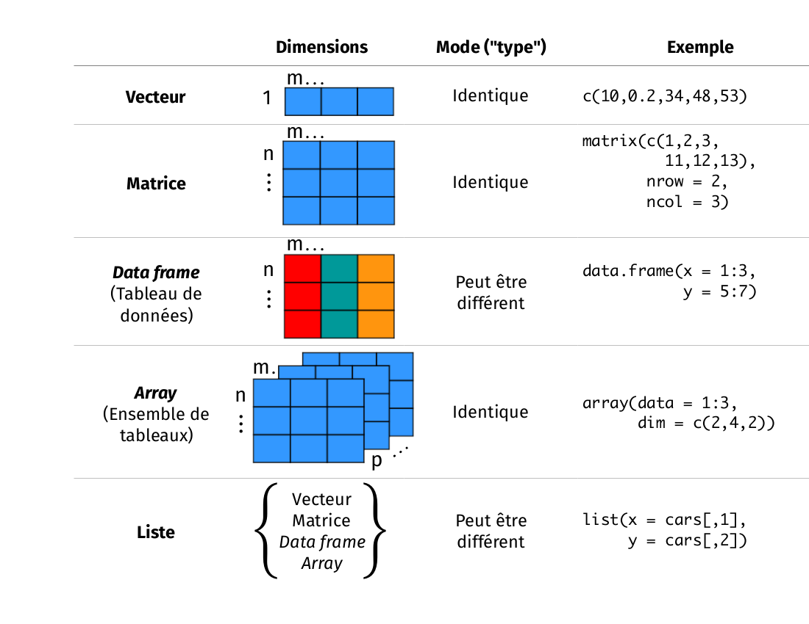

---
output:
  pdf_document: default
  html_document: default
---
# Manipuler les objets dans R

## Objet

------------------------------------------------------------------------

Jusqu'à maintenant, vous avez appris à utiliser R comme calculatrice
afin d'obtenir différentes valeurs numériques. Cependant, si vous devez
utiliser certaines valeurs ou calculs fréquemment, ça peut rapidement
devenir ennuyeux de toujours devoir réécrire le même code dans la
console. Le concept d'objet permet d'enregistrer certaines étapes afin
de vous faire sauver du temps.

R est un langage de programmation par objet (*object-oriented
programming language*). Ça signifie qu'on peut allouer un nom à des
valeurs qu'on a créées afin de les enregistrer dans un espace de
travail. Un objet est composé de trois parties : 1) une valeur
d'intérêt, 2) un identifiant et 3) l'opérateur d'assignation.

1.  La valeur d'intérêt peut être à peu près de n'importe quelle nature : un nombre, le résultat d'un calcul, une chaîne de caractères, un
    tableau de données, un graphique ou une fonction.
2.  L'identifiant est le nom qui est assigné à la valeur d'intérêt.
    Lorsqu'on veut faire référence à cette valeur, il suffit simplement
    de taper son nom à la console et R va afficher cette valeur. Les
    identifiants peuvent seulement inclure des lettres, des chiffres,
    des points et des traits de soulignement (*underscore*). Ils doivent
    toujours débuter par une lettre.
3.  L'opérateur d'assignation ressemble à une flèche (`<-`) et est
    utilisé afin de lier la valeur d'intérêt à son identifiant.

Le code suivant illustre le concept d'objet :

```{r, echo = TRUE, eval = TRUE}
#Commençons par créer un objet nommé moy_x.
#Le symbole # est utilisé dans R afin d’indiquer les commentaires à l’intérieur d’un code.
#Ces lignes ne sont pas traitées par R.
#C’est très important d’ajouter des commentaires à un code,
#car ça permet à d’autres personnes de mieux le comprendre et de l’utiliser.
moy_x <- (2 + 6) / 2
#En tapant le nom de l’objet dans la console, R retourne la valeur de l’objet.
moy_x
```

Dans cet exemple, `(2 + 6) / 2` est la valeur qu'on souhaite enregistrer
en tant qu'objet. L'identifiant \"moy_x\" est assigné à cette valeur. En
tapant `moy_x` à la console, R retourne la valeur du calcul (*i.e.* 4).
Il faut être très scrupuleux lorsqu'on entre l'identifiant à la console,
car R fait la différence entre les lettres minuscules et majuscules :
écrire `moy_x` n'est pas la même chose qu'écrire `MOY_X`. On peut voir
que l'opérateur d'assignation `<-` créer un lien explicite entre la
valeur d'intérêt et son identifiant. L'opérateur d'assignation pointe
toujours de la valeur vers l'identifiant. Si votre clavier est configuré
en anglais la combinaison de touche `Alt` + `-` vous permettra
d'insérer directement l'opérateur `<-`. Il est également possible
d'utiliser le symbole d'égalité `=` comme opérateur d'assignation, mais
[c'est préférable de ne pas
l'utiliser](http://stackoverflow.com/questions/1741820/assignment-operators-in-r-and).
Le symbole d'égalité est aussi utilisé pour d'autres opérations dans R,
ce qui pourrait causer des problèmes lorsqu'on l'utilise comme opérateur
d'assignation. Finalement, imaginez que l'opérateur `<-` et `=` ont une
priorité d'opération :

```{r, echo = TRUE, eval = TRUE, error=TRUE}
y <- x = 5
y = x <- 5
y
x
```

------------------------------------------------------------------------

### Bonnes pratiques du code R

**Nom**:

-   Essayez d'avoir des noms courts et explicites pour vos variables.
    Nommer une variable `var` n'est pas très instructif.
-   Utilisez un trait de soulignement `_` pour séparer les mots d'un
    nom ou essayez d'être constant!
-   Évitez les noms d'objets de fonction qui existe dans R (e.g. `c` ou
    `table`)

**Espace**:

-   Ajoutez des espaces autour de tous les opérateurs (`=`, `+`, `-`,
    `<-`, etc.) pour rendre le code plus lisible
-   Mettez un espace après une virgule, mais jamais avant (comme en
    français).

------------------------------------------------------------------------

### DÉFI 5

Créez un objet avec une valeur de 1 + 1.718282 (*i.e.* le nombre d'Euler) et nommez le `valeur_euler`.

#### Solution {-}

```{r, echo = TRUE, eval = TRUE}
valeur_euler <- 1 + 1.718282
valeur_euler
```


------------------------------------------------------------------------

### DÉFI 6

Créez un objet (vous choisissez la valeur) avec un nom débutant par un
chiffre. Que se passe-t-il?

#### Solution {-}
Un objet débutant par un chiffre va retourner
l'erreur suivante : `Error: unexpected symbol in "votre nom d'objet"`. 

------------------------------------------------------------------------

**Truc R**

La touche « Tabulation » permet de compléter automatiquement les noms
d'objets. Ça accélère l'entrée des commandes et ça évite les erreurs de
frappe. Par exemple, si vous tapez `val` et appuyez sur « Tabulation »
ensuite, vous allez voir une liste d'objets ou de fonctions débutant par
`val`. Sélectionnez `valeur_euler` (l'objet que vous venez de créer) et
appuyez sur « Entrée ». L'identifiant `valeur_euler` apparaît maintenant
dans la console.

## Types de structures de données en R

------------------------------------------------------------------------

Le logiciel R est un outil très puissant pour l'analyse des données. Les
données existent sous plusieurs formes, mais peuvent être regroupées en
catégories distinctes. R classifie les données selon la nature des
valeurs contenues dans un objet. La figure suivante illustre les types
de données couramment rencontrés dans R.

{.align-center width="500"}

**Types de structures de données en R: le vecteur**

Le premier type d'objet est le **vecteur**. C'est un des objets les plus
communs dans R. Un vecteur est une entité constituée d'une liste de
valeurs semblables. Toutes les valeurs d'un vecteur doivent avoir le
même mode (ou classe). Les principaux modes dans R sont **numérique**,
**caractère** et **logique**. Les vecteurs numériques sont seulement 
composés de nombres. Les vecteurs de caractères sont généralement
composés de chaînes de caractères ou d'un mélange de chaînes de
caractères et de valeurs numériques et logiques. Il est absolument
nécessaire d'utiliser les guillemets `" "` afin de délimiter les chaînes
de caractères. Les vecteurs logiques sont composés des mots `TRUE` et
`FALSE` seulement. Un vecteur composé d'un seul élément (généralement
une constante) est appelé un vecteur atomique.

Avant d'apprendre à créer différents types de vecteurs, regardons
comment un vecteur est créé de manière générique. Si vous vous rappelez
ce que vous venez tout juste d'apprendre, vous devez premièrement avoir
une valeur d'intérêt que vous voulez intégrer dans un vecteur et ensuite
le lier à un identifiant avec l'opérateur d'assignation (*i.e.* créer un
objet). Lorsque vous avez plus d'une valeur dans un vecteur, il est
nécessaire d'indiquer au logiciel R qu' il faut regrouper ces valeurs au
sein d'un même vecteur. Pour ce faire, il faut utiliser la fonction
`c()`. Ne vous en faites pas ! Vous allez bientôt apprendre ce qu'est
une fonction dans une des sections suivantes. Pour l'instant, sachez que
vous devez mettre vos valeurs que vous souhaitez avoir dans un vecteur
entre parenthèses tout juste après la lettre `c()` dans la console de R.
Le format est le suivant :
`nom.du.vecteur <- c(valeur1, valeur2, valeur3, ...)`. La fonction `c()`
signifie combiner ou concaténer. C'est une fonction facile et très
utile, alors rappelez-vous en !

Vous connaissez la méthode générique pour créer un vecteur dans R.
Regardons maintenant comment générer différents types de vecteurs
(*i.e.* de différents modes).

```{r, echo = TRUE, eval = TRUE}
#Créez un vecteur numérique avec la fonction c (qui signifie combiner ou concaténer).
num_vecteur <- c(1, 4, 3, 98, 32, -76, -4)
num_vecteur

#Créez un vecteur de caractères. N’oubliez pas les guillemets !
car_vecteur <- c("bleu", "rouge", "vert")
car_vecteur

#Créez un vecteur logique ou booléen. N’utilisez pas les guillemets sinon R va considérer les éléments
#comme des chaînes de caractères.
bool_vecteur <- c(TRUE, TRUE, FALSE)
bool_vecteur

#C’est aussi possible d’utiliser les abréviations pour les vecteurs logiques.
bool_vecteur2 <- c(T, T, F)
bool_vecteur2
```

------------------------------------------------------------------------

### DÉFI 7

Créez un vecteur comprenant les cinq premiers nombres impairs (en
commençant par 1) et nommez ce vecteur \"impair\".

#### Solution {-}
```{r, echo = TRUE, eval = TRUE}
impair <- c(1, 3, 5, 7, 9)
```


------------------------------------------------------------------------

**Truc R**

Utilisez la fonction `dput()` pour obtenir l'inverse, c'est-à-dire le
contenue d'un objet sous forme de vecteur. Par exemple :

```{r, echo = TRUE, eval = TRUE}
impair <- c(1, 3, 5, 7, 9)
impair

#  La réponse que R retourne en inscrivant ''impair'' n’est pas directement utilisable
# (puisqu’elle n’est pas dans la fonction ''c()'' et les chiffres ne sont pas entourés de virgules).

dput(impair)

# La sortie peut être copiée et collée pour créer un nouvel objet en utilisant la fonction structure()
structure(c(1, 3, 5, 7, 9))

```

Cette démonstration n'est peut-être pas convaincante, mais ces fonctions
peuvent s'avérer fort utiles lors de la manipulation de données!
Notamment si vous souhaitez fournir un exemple reproductible dans le cas
d'une question sur [Stack Overflow](https://stackoverflow.com/), par
exemple.

------------------------------------------------------------------------

Ce que vous avez appris dans la première section est également valide
pour les vecteurs : les vecteurs peuvent être utilisés dans des calculs.
La seule différence est que, lorsqu'un vecteur a plus d'un élément,
l'opération est appliquée à tous les éléments du vecteur. L'exemple
suivant clarifie ceci.

```{r, echo = TRUE, eval = TRUE}
#Créez deux vecteurs numériques.
x <- 1:5
# Rappelez-vous que le symbole '':'', lorsqu’utilisé avec des chiffres, est l’opérateur de séquence.
# Ça indique à R de créer une série qui augmente de 1.
# C’est équivalent à écrire x <- c(1, 2, 3, 4, 5)
# Une autre façon équivalente est : x <- c(1:5).

y <- 6

# Faisons la somme des deux vecteurs.
# 6 est ajouté à tous les éléments du vecteur x.
x + y

# Multiplions x par y.
x * y

```

------------------------------------------------------------------------

**Types de structures de données en R: le data frame**

Un autre type d'objet couramment utilisé en écologie est le **data frame**
(c-à-d. tableau de données). Un data frame est un groupe de vecteurs de
la même longueur (*i.e.* avec le même nombre d'éléments). Les variables
sont toujours représentées en colonnes et les observations, cas,
individus, sites ou répétitions sont toujours représentés en lignes. Un
data frame peut être composé de plusieurs modes, mais une colonne doit
toujours contenir le même mode. C'est sous ce format que la plupart des
données écologiques sont enregistrées. L'exemple suivant présente un jeu
de données fictif représentant quatre sites où le pH du sol et le nombre
d'espèces ont été mesurés. On y trouve également une colonne de
traitement (fertilisé ou non). Regardons plus en détail comment créer un
tel tableau de données.

  site_id   pH_sol   num_sp   traitement
  --------- -------- -------- ---------------
  A1.01     5.6      17       Fertilisé
  A1.02     7.3      23       Fertilisé
  B1.01     4.1      15       Non Fertilisé
  B1.02     6.0      17       Non Fertilisé

N. B. Les noms des colonnes et leur contenu n'ont ni accent, ni
d'espace, ni caractères spéciaux puisque R préfère une seule suite de
caractères comme titre. Ainsi, num_sp représente bien 'Nombre
d'espèces', mais R préfère la forme 'num_sp'. Il en va de même pour
le contenu du tableau (pas 'Fertilisé', mais bien 'Fert').

```{r, echo = TRUE, eval = TRUE}
# On commence par créer les vecteurs.
site_id <- c("A1.01", "A1.02", "B1.01", "B1.02") # l'identifiant du site
pH_sol <- c(5.6, 7.3, 4.1, 6.0) #la mesure du pH du sol à chaque site
num_sp <- c(17, 23, 15, 7) #le nombre d'espèces observées
traitement <- c("Fert", "Fert", "Non_fert", "Non_fert") #traitement appliqué

# On peut grouper tous ces vecteurs en un data frame avec la fonction data.frame().
mon_df <- data.frame(site_id, pH_sol, num_sp, traitement)

# On l’affiche à la console!
mon_df
```

------------------------------------------------------------------------

**Truc R**

Voici la fonction `dput()` dans un exemple plus concret:

```{r, echo = TRUE, eval = TRUE}
dput(mon_df)

# Il est possible de reconstruire le data frame initial (avec certaines métadonnées associées, telles que la classe des variables par exemple) en copiant-collant la sortie précédente
structure(list(site_id = c("A1.01", "A1.02", "B1.01", "B1.02"
), pH_sol = c(5.6, 7.3, 4.1, 6), num_sp = c(17, 23, 15, 7), traitement = c("Fert",
"Fert", "Non_fert", "Non_fert")), class = "data.frame", row.names = c(NA, -4L))

```

------------------------------------------------------------------------

Les autres types d'objets pour stocker des données qu'on retrouve dans R
sont les **matrices**, les **tableaux** (*i.e.* array en anglais) et les **listes**.
Une matrice est très similaire à un data frame à l'exception que toutes
les cellules de la matrice doivent être du même mode. Un array est
similaire à une matrice, mais peut avoir plus de deux dimensions. Les
arrays sont surtout utilisés pour des calculs avancés tels que des
simulations numériques et des tests de permutations. Une liste est un
groupement de plusieurs types d'objets différents. Par exemple, une
liste pourrait comprendre un vecteur, un tableau de données et une
matrice au sein du même objet.

## Indexer des objets dans R

------------------------------------------------------------------------

### Indexer un vecteur

Lorsqu'on tape le nom d'un objet dans la console, R retourne l'objet en
entier. Par contre, ce n'est pas pratique si l'objet est, par exemple,
une énorme base de données avec des millions de lignes. Ça peut
rapidement devenir difficile d'identifier des éléments précis d'un
objet. R nous permet d'extraire certaines parties d'un objet en indexant
ce dernier. Il suffit de spécifier la position des valeurs à l'intérieur
d'un objet qu'on souhaite extraire à l'aide des crochets `[ ]`. Le code
suivant illustre le concept d'indexation des vecteurs.

```{r, echo = TRUE, eval = TRUE}
# Créons tout d’abord un vecteur numérique et un vecteur de caractères.
# Ce n’est pas nécessaire de faire cette étape si vous l’avez déjà fait dans un exercice précédent.
impair <- c(1, 3, 5, 7, 9)

# Extrayons le deuxième élément du vecteur numérique.
impair[2]


# Extrayons les 2ème et 4ème éléments du vecteur numérique.
impair[c(2, 4)]

# Extrayons tous les éléments du vecteur numérique sauf les deux premières.
impair[c(-1, -2)]

# Si nous sélectionnons une position qui n'existe pas dans le vecteur numérique.
impair[c(1,6)]
```

Il n’y a pas de sixième valeur dans ce vecteur, donc R retourne une valeur nulle (i.e. NA). NA signifie 'Not available'.

```{r, echo = TRUE, eval = TRUE}
# Nous pouvons également utiliser des conditions pour sélectionner des valeurs.
impair[impair > 4]

# Nous pouvons procéder de même sur les vecteurs de caractère
# Extraire tous les éléments correspondant exactement à « bleu » du vecteur de caractères.
# Prenez note de l’utilisation du double signe d’égalité ==.
car_vecteur[car_vecteur == "bleu"]

```

------------------------------------------------------------------------

### DÉFI  8

 a) Extraire la quatrième valeur du vecteur numérique num_vecteur.

 b) Extraire les première et troisièmes valeurs du vecteur numérique
 num_vecteur.

 c) Extraire toutes les valeurs du vecteur numérique num_vecteur à
 l'exception des deuxième et quatrième valeurs.

#### Solution {-}

a) Indexer des vecteurs

```{r, echo = TRUE, eval = TRUE}
 num_vecteur[4]
```

b) Indexer des vecteurs

```{r, echo = TRUE, eval = TRUE}
num_vecteur[c(1,3)]
```

c) Indexer des vecteurs

```{r, echo = TRUE, eval = TRUE}
num_vecteur[c(-2,-4)]
```


------------------------------------------------------------------------

### DÉFI 9

Explorez la différence entre ces deux lignes de codes :

```{r, echo = TRUE, eval = TRUE}
car_vecteur == "bleu"

car_vecteur[car_vecteur == "bleu"]
```


#### Solution {-}
Différences entre codes: La première ligne de code évalue
une déclaration logique. Pour chaque élément du vecteur `car_vecteur`, R
vérifie si cet élément est exactement égal à « bleu » ou non et retourne
une réponse (TRUE ou FALSE). La prochaine sous-section présente une
brève introduction aux déclarations logiques. La deuxième ligne de code
demande à R d'extraire tous les éléments à l'intérieur du vecteur
`car_vecteur` qui sont exactement égaux à « bleu ». Il est également
possible d'extraire la valeur « bleu » en attribuant une valeur logique
à chaque valeur du vecteur. Pour cela, il faut bien sûr connaître la
position de la valeur « bleu » à l'intérieur du vecteur.

```{r, echo = TRUE, eval = TRUE}
car_vecteur[c(TRUE, FALSE, FALSE)]
# On spécifie ici que la première valeur est "vraie",
# c'est-à-dire qu'on souhaite que R nous retourne la première valeur
# du vecteur car_vecteur, soit "bleu".
```

------------------------------------------------------------------------

### Indexer un data frame

L'indexation des data frames est similaire à celle des vecteurs, mais il
est généralement nécessaire de spécifier deux dimensions : le numéro de
ligne et de colonne. Pour ce faire, la syntaxe dans R est :

`data frame[numéro de ligne, numéro de colonne]`.

Voici quelques exemples d'indexation de data frames. Prenez note que les
quatre premières opérations sont également valides pour les matrices.

```{r, echo = TRUE, eval = TRUE}
# Réutilisons le data frame créé précédemment (mon_df)
# Extrayons la première ligne du data frame.
mon_df[1, ]

# Extrayons la troisième colonne du data frame.
mon_df[, 3]
# Notez qu'un index vide sélectionne toutes les valeurs

# Extrayons le deuxième élément de la quatrième colonne du data frame.
mon_df[2, 4]

# Extrayons les lignes 2 et 4 du data frame.
mon_df[c(2,4), ]

# Extrayons la colonne « site_id » en référant directement à son nom.
# Le signe de dollar ($) permet une telle opération !
mon_df$site_id

# Extrayons la deuxième valeur de la colonne « site_id »
mon_df$site_id[2]

# Extrayons les variables « site_id » et « pH_sol ».
mon_df[,c("site_id","pH_sol")]
```

------------------------------------------------------------------------

### Un bref commentaire sur les déclarations logiques

R permet de tester les déclarations logiques, i.e. tester si une
déclaration est vraie ou fausse. Vous devez utiliser des opérateurs
logiques pour cela.

  Opérateur   Description             
  ----------- ---------------------- 
  \<          plus petit que          
  \<=         plus petit ou égal à    
  \>          plus grand que          
  \>=         plus grand ou égal à    
  ==          exactement égal à       
  !=          pas égal à              
  x \| y      x OU y                  
  x & y       x ET y                  

Les exemples suivants illustrent comment utiliser ces opérateurs de
manière appropriée.

```{r, echo = TRUE, eval = TRUE}
# Commençons par créer deux vecteurs à comparer.
x2 <- c(1:5)
y2 <- c(1, 2, -7, 4, 5)

# Vérifions si les éléments de x2 sont plus grand ou égaux à 3.
# R retourne une valeur TRUE/FALSE pour chaque élément (dans le même ordre que x2).
x2 >= 3

# Vérifions si les éléments de x2 sont exactement égaux à ceux de y.
x2 == y2

# Est-ce que 3 n’est pas égal à 4? Bien sûr!
3 != 4

# Vérifions quels éléments de x2 sont plus grands que 2, mais plus petits que 5.
# Il faut réécrire x2 deux fois pour que ça fonctionne!
x2 > 2 & x2 < 5
# Écrire x2 > 2 & < 5 va retourner une erreur !
```


### DÉFI 10

 a) Extrayez la colonne `num_sp` du tableau `mon_df` et
 multipliez-la par les quatre premières valeurs du vecteur
 `num_vecteur`.
 b) Ensuite, écrivez une déclaration logique qui vérifie si chaque
 valeur obtenue est supérieure à 25. Référez-vous au défi 9 pour
 compléter cette question.


#### Solution {-}

a) Indexer et multiplier

```{r, echo = TRUE, eval = TRUE}
mon_df$num_sp * num_vecteur[c(1:4)]
# Ou encore
mon_df[, 3] * num_vecteur[c(1:4)]
```

b) Déclaration logique

```{r, echo = TRUE, eval = TRUE}
(mon_df$num_sp * num_vecteur[c(1:4)]) > 25
```


