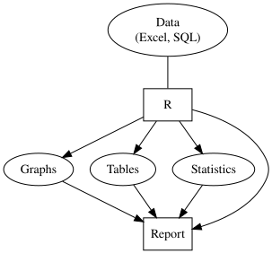

```{r setup, echo = FALSE}
knitr::opts_chunk$set(
  comment = "#",
  collapse = TRUE,
  warning = FALSE,
  message = FALSE,
  cache = TRUE, # turn into FALSE before pushing
  fig.width=5, fig.height=5, 
  fig.retina=3,
  fig.align = 'center'
)
options(repos=structure(c(CRAN="http://cran.r-project.org")))
```

class: inverse, center, middle

```{r install_pkgs, message=FALSE, warning=FALSE, include=FALSE, results=0}
# Standard procedure to check and install packages and their dependencies, if needed.

list.of.packages <- c("waffle", "ggpubr", "htmlwidgets", "DiagrammeR", "DiagrammeRsvg", "rsvg")

new.packages <- list.of.packages[!(list.of.packages %in% installed.packages()[,"Package"])]

if(length(new.packages) > 0) {
  install.packages(new.packages, dependencies = TRUE) 
  print(paste0("The following package was installed:", new.packages)) 
} else if(length(new.packages) == 0) {
  print("All packages were already installed previously.")
}

# Load all required libraries at once
lapply(list.of.packages, require, character.only = TRUE, quietly = TRUE)
```

# About this workshop

[](https://r.qcbs.ca/workshop01/pres-en/workshop01-pres-en.html)
[](https://r.qcbs.ca/workshop01/book-en/index.html)
[](https://r.qcbs.ca/workshop01/book-en/workshop01-script-en.R)
[](https://github.com/QCBSRworkshops/workshop01)

---
# Learning Objectives
<br>

##### 1. Recognize and use `R` and **RStudio**;

##### 2. Use `R` as a calculator;

##### 3. Manipulate objects in `R`;

##### 4. Install and use `R` packages and functions;

##### 5. Get help.

---
class: inverse, center, middle

# 1. Recognizing and using `R` and **RStudio**

<hr>

## Introduction

---

# What is `R`?

.pull-left[
* `R` is a free an open-source programming language and environment.

<br>

* It is designed for data analysis, graphical display and data simulations.

<br>

* It is one of the world's leading statistical programming environments.

]

.pull-right[.center[

]
]

---
# Why should I become an use`R`?

* `R` is **free**, **open source**: built for you and for everyone;
* `R` is **popular**: a large enganged user-base fosters the continued development and the maintainance of statistical tools;
* `R` is **powerful**
  - You can program complex simulations
  - Use it on high performance clusters
* `R` supports extensions
* `R` runs on most operating systems
* `R` connects with other languages: `C++`, `Java`, `Python`, `Julia`, `Stan` and more!

<!-- .right[  ] -->

.center[

]


---
# Why use `R`?

.pull-left[

.center[An example of a workflow to analyze data _without_ `R`.]

<br>

```{r workflow-without-R-flow, echo = FALSE, out.width = '90%'}
  grViz("
      digraph {

      node [shape = oval, fillcolor = PaleTurquoise]
      'Data \n (Excel, SQL)'; 
      Graphs; 
      Tables; 
      Statistics

      node [shape = box]
      Sigmaplot; Excel; SAS

      ##add arrows
      edge [arrowhead = none]
      'Data \n (Excel, SQL)' -> Sigmaplot; 
      'Data \n (Excel, SQL)' -> Excel; 
      'Data \n (Excel, SQL)' -> SAS; 
      Graphs -> Word; Tables -> Word; 
      Statistics -> Word;  
      Graphs -> Powerpoint; 
      Tables -> Powerpoint; 
      Statistics -> Powerpoint

      edge [arrowhead = normal]
      Sigmaplot -> Graphs; 
      Excel -> Tables; 
      SAS -> Statistics; 
      Word -> Report; 
      Powerpoint -> Report

      }
    ") %>%
export_svg() %>%
charToRaw() %>%
rsvg_svg("images/workflow-without-R-flow.svg")
  

```
]

--

.pull-right[

.center[`R` allows you to do a lot without needing to use other programs.]

<br>

```{r workflow-with-R-flow, echo = FALSE, out.width = '90%'}
  grViz("
      digraph {

      node [shape = oval, fillcolor = PaleTurquoise]
      'Data \n (Excel, SQL)'; 
      Graphs; 
      Tables; 
      Statistics

      node [shape = box]
      R

      ##add arrows
      edge [arrowhead = none]
      'Data \n (Excel, SQL)' -> R;

      edge [arrowhead = normal]
      R -> Graphs; 
      R -> Tables; 
      R -> Statistics; 
      Graphs -> Report; 
      Tables -> Report; 
      Statistics -> Report;
      R -> Report

      }") %>%
export_svg() %>%
charToRaw() %>%
rsvg_svg("images/workflow-with-R-flow.svg")
  


```

]

---
# Why use `R`?

- More and more scientists use it every year!
- As of October 2020, there are more than 16000 packages registered within the **Comprehensive R Archive Network (CRAN)** (and thousands more within Github repositories)!

```{r, echo = FALSE,   fig.width=10, fig.height=6}
# Data from https://gist.github.com/daroczig/3cf06d6db4be2bbe3368#file-results-csv

# Load the data
pkgs <- read.csv(file="data/results.csv")

# Load ggplot 
library(ggplot2)

# Graph 
ggplot(pkgs, aes(as.Date(first_release), index)) +
    geom_line(size = 2) +
    scale_x_date(date_breaks = '1 year', date_labels = '%Y') +
    scale_y_continuous(breaks = seq(0, 16000, 1000)) +
    xlab('') + ylab('') + theme_bw() +
    ggtitle('Number of R packages published on CRAN') + 
  theme(axis.ticks = element_line(colour = "black"), 
    panel.grid.minor = element_line(linetype = "blank"), 
    plot.title = element_text(size = 25, face = "bold"),
    axis.text = element_text(size = 18, colour = "black", vjust = 0), 
    axis.text.x = element_text(size = 18, colour = "black", vjust = 0.5, angle = 90), 
    axis.text.y = element_text(size = 18, vjust = 0.5, colour = "black"), 
    panel.background = element_rect(fill = NA)) +
  labs(x = NULL, y = NULL)
```


<!-- .center[] -->

---
# A lot of features: customizable graphs 

All of these graphs were made in `R`!

.center[]

---
# And what about **RStudio**?

**RStudio** is the most used Integrated Development Environment (**IDE**) for `R`.

It includes a **console**, a **syntax-highlighting editor** that supports direct code execution with tools for plotting, history, debugging and workspace management.

It integrates with `R` (and other programming languages) to provide a lot of useful features:

.pull-left[
.center[
RStudio supports authoring HTML, PDF, Word and presentation documents

]
]

.pull-right[
.center[
RStudio supports version control with Git (directly to Github) and Subversion

]
]

---
# And what about **RStudio**?

**RStudio** is the most used Integrated Development Environment (**IDE**) for `R`.

It includes a **console**, a **syntax-highlighting editor** that supports direct code execution with tools for plotting, history, debugging and workspace management.

It integrates with `R` (and other programming languages) to provide a lot of useful features:

.pull-left[
.center[
RStudio make it easy to start new or find existing projects

]
]

.pull-right[
.center[
RStudio supports interactive graphics with Shiny and ggvis

]
]
--
<br>

There are other IDE for `R`: **Atom**, **Visual Studio**, **Jupyter notebook** and **Jupyter lab**!

---
# Challenge

.pull-left2[
- Throughout these workshops, **challenges** will be indicated by Rubik cubes. 
- Sometimes, you will be expected to collaborate with other participants!
- Do not hesitate to ask questions! 
]


.pull-right2[

]


---
# First Challenge

Open **RStudio**.

<br>

<br>

<br>

.center[Let us do this one together!]

<br> 

<br>
.center[

]

???

Here, the workshop instructor may minimize the presentation and show his RStudio window and point out all View panes being displayed, briefly explaining each one of them.

Be sure to adjust the font size and scale of the window according to the presentation being given (remote presentations allow for smaller font size).

---
## Note for Windows users

If the restriction `unable to write on disk` appears when you attempt to open **RStudio** or to install a package.

.center[.alert[Do not worry!]]

.large[We have the solution!]

- Close the application.
- Right-click on your **RStudio** icon and click on "Execute as Administrator". This will provide file and directory writing rights to **RStudio**.

---
# The RStudio **Interface**
.pull-left[
When you open **RStudio** for the first time, the screen will be divided across three main **Pane** groups: 
1. **Console, Terminal, Job** group;
2. **Environment, History, Connections** group; 
3. **Files, Plot, Packages, Help, Viewer** panes; and,
4. **Script** pane group.

<br>
Once you *Open a Script* or *Create a New Script* (*File > New File > R Script* or `Ctrl/Cmd + Shit + N`), the fourth panel will appear!

<br>
]

.pull-right[
<br>

]


???

Most of the action happens here!


---
# The RStudio **Console**

- Usually, the first text you see within the **Console** pane is the `R` version **RStudio** is using.
<br>

- The **Console** is the place where `R` is waiting for you to tell it what to do, and is where it will communicate with you, showing the outcome of your command.
<br>

- Whenever `R` is ready to accept commands, it will show a `>` prompt.

.center[

]


---
# Reading the **Console**

.pull-left[Text in the console typically looks like this:

```{r, include = FALSE}
output <- "This is the output"
```

```{r}
output
```
]
.pull-right[
<br>
.comment[Remember that one must write the command in front of the `>` prompt and then press "Return" it to run.]
]

<br>

.center[What does the square brackets `[ ]` within the output mean?]

--

<br>

The numbers within the brackets help you to locate the position of elements within the output.

```{r, echo = TRUE}
seq(1, 100, by = 2)
```

???

Show the participants how the number between the square brackets indicates position of the elements.

---
# Error and Warning

Often, the **Console** will output **Errors** and **Warning** messages.

.pull-left[
.alert[Warning message] 

```{r error=TRUE, message=TRUE, warning=TRUE}
x <- c("2", -3, "end", 0, 4, 0.2)
as.numeric(x)
```

  * Cautions users about an action, but still executes the function.
  * There might be an issue with the input and/or the output.
]

.pull-right[

.alert[Error message] 

```{r, error = TRUE}
x*10
```

  * Informs the user that there is a problem that prevents the command from running. 
  * One needs to solve the issue in order to carry on.

]

<br>
.center[
**Google is your best friend in solving Errors or Warnings!**
]


---
class: inverse, center, middle

# 2. Using `R` as a calculator &nbsp; 

<hr>

## Basic operations

---
# Arithmetic Operators

- Additions and Subtractions

```{r}
1 + 1

10 - 1
```

--

- Multiplications and Divisions

```{r}
2 * 2

8 / 2
```

--

- Exponents

```{r}
2^3
```

---

# Challenge 


Use `R` to calculate the following equation:

$$
2+16*24-56
$$

<br>
<br>

.comment[**Hint**: The `*` symbol is used to multiply.]

---
# Challenge: Solution 

Use `R` to calculate the following equation:

$$
2+16*24-56
$$

It would look like this in `R`:

```{r}
2 + 16 * 24 - 56
```

---
# Challenge 

Use `R` to calculate the following equation:

$$
2+16*24-56 / (2+1)-457
$$

<br>
<br>

.comment[**Hint**: Think about the order of the operation.]

---
# Challenge: Solution 

Use R to calculate the following equation:

$$
2+16*24-56 / (2+1)-457
$$

It would look like this in `R`:

```{r}
2 + 16 * 24 - 56 / (2 + 1) - 457
```

<br>

.comment[Note that `R` respects the order of the operations]


---
# Still using `R` for arithmetic operations

What is the area of a circle with a radius of $5\ cm$?
.pull-left[
```{r echo = FALSE, fig.height = 4, fig.width = 4}
radius <- 1
theta <- seq(0, 2 * pi, length = 200)

par(pty="s") # create a square plot instead of a rectangle

# Plot canvas
plot(c(-1, 1), c(-1, 1), 
     type = "n", ann = F, axes = F, asp = 0,
     title = NULL,
     xaxs="i", yaxs =  "i") #remove padding

# Add circle
lines(x = radius * cos(theta), 
      y = radius * sin(theta), lwd =4)
arrows(0, 0, x1 = 1, length = 0, lwd = 4, col = "red")

# Center of the circle 
points(0,0, pch = 20)

# Add text to indicate the radius 
text(x = 0.05, y = .2, "radius = 5 cm", cex = 1.5)
```
]
.pull-right[
<br> 
.comment[$$Area_{circle} = \pi \times r^2$$]
]

---
# Still using `R` for arithmetic operations

What is the area of a circle with a radius of $5\ cm$?
.pull-left[
```{r echo = FALSE, fig.height = 4, fig.width = 4}
radius <- 1
theta <- seq(0, 2 * pi, length = 200)

par(pty="s") # create a square plot instead of a rectangle

# Plot canvas
plot(c(-1, 1), c(-1, 1), 
     type = "n", ann = F, axes = F, asp = 0,
     title = NULL,
     xaxs="i", yaxs =  "i") #remove padding

# Add circle
lines(x = radius * cos(theta), 
      y = radius * sin(theta), lwd =4)
arrows(0, 0, x1 = 1, length = 0, lwd = 4, col = "red")

# Center of the circle 
points(0,0, pch = 20)

# Add text to indicate the radius 
text(x = 0.05, y = .2, "radius = 5 cm", cex = 1.5)
```
]
.pull-right[
<br> 
$$Area_{circle} = \pi \times r^2$$
```{r}
3.1416 * 5^2
```
]
--

.pull-left[
But... `R` has built-in constants! 

You can find them by typing `?` and `Constants` (as in `?Constants`) and executing it! What is the one for $\pi$? 

]
.pull-right[
We can then write and execute this:

```{r}
pi * 5^2
```
]

.small[
.center[You have just ran a command preceeded by `?`. _What happened?_]
]

---
class: middle, center

## A tip

We can use the $\uparrow$ and $\downarrow$ arrow keys to retrieve commands previously run.

Make sure your cursor is blinking in front of the `>` prompt and give it a try!

.center[

]


---
class: inverse, center, middle

# 3. Manipulating objects in `R`

<hr>

---
# `R`: an object-oriented environment

You can **assign** information to named **objects** using the assignment operator `<-`.

The information is assigned to the name that is pointed by the assignment operator `<-`.

See the examples below:

.pull-left[
```{r, eval = TRUE, echo = TRUE}
money_talks <- "ACDC"
money_talks
```
]
.pull-right[
```{r, eval = TRUE, echo = TRUE}
9 -> my_birthday_month
my_birthday_month
```
]

<br>

.center[.alert[Careful! There is no space between the less than (`<`) and minus (`-`) signs.]]

<br>

--

One can assign values using `=` instead of the `<-` operator. We caution against using `=` to assign values to objects because the `=` is allowed at the top level only and also determines subexpressions.

---

# Naming **objects**: a few rules

Objects names can only include:

<br>

|  Type      |  Symbol |
|------------|:-------:|
| Letters    | a-z A-Z |
| Numbers    |     0-9 |
| Period     |       . |
| Underscore |       _ |

<br>

1. Objects names must **always** begin with a letter.
2. `R` is **case-sensitive**: `Data_1` is different than `data_1`.
3. You **cannot** use special characters (`@`, `/`, `#`, etc.).
4. Object names must be **unique**: `data_1 <- 1` will overwrite any previously objects named `data_1`

---

#.small[Good practice when naming objects and writing code]


**Short and explicit names are preferred**. 
- Naming a variable `var`  is not very informative.

**You can separate words within a name using underscores ( `_` ) or dots ( `.` )**.
- `avg_richness` or `avg.richness` are easier to read than `avgrichness`.

**Avoid using names of existing functions or constants (e.g., `c`, `table`, `T`, `matrix`)**

<br>
--

**Add spaces around operators** (`=`, `+`, `-`, `<-`, etc.) **to make the code more readable.**

**Always put a space after a comma**, and never before (like in regular English).

<br>
.pull-left[
**Preferred**
```{r}
mean_x <- (2 + 6) / 2

mean_x
```
]

.pull-right[
**Not preferred**
```{r}
meanx<-(2+6)/2
meanx
```
]

---

# Challenge 

Create an object with a name (of your choice) that starts with a number. What happens?

---
# Challenge: Solution 

Create an object with a name (of your choice) that starts with a number. What happens?

<br>
<br>
<br>

<br>

Creating an object name that starts with a number returns the following error:

```{r, eval = FALSE}
Error: unexpected symbol in "your object name"
```

---
# Challenge 

Create an object with a value of `1 + 1.718282` ([_e_ or Euler's number](https://en.wikipedia.org/wiki/E_(mathematical_constant)) and name it `euler_value`.

---
# Challenge: Solution 

Create an object with a value of `1 + 1.718282` ([_e_ or Euler's number](https://en.wikipedia.org/wiki/E_(mathematical_constant)) and name it `euler_value`.

<br>

```{r}
euler_value <- 1 + 1.718282

euler_value
```

--

<br>

<br>

<br>

.center[What has happened in your **RStudio** window when you created this object?]

<br>

???

The presenter should not here that the object will appear in the RStudio Environment.

---
# The **RStudio** Environment

The **Environment** panel shows you all the objects you have defined in your current workspace.

.center[ ]

---
class: middle, center

## Tip

You can use the `Tab` key to auto-complete commands. 

This helps preventing spelling errors

<br>

.center[**Let us try it!**]

<br>

Try writing `eul` or `abb` in front of the `>` prompt and press `Tab`.

If more than one element appears, you can use the arrow keys ( $\uparrow$  $\downarrow$ ) and press "Return" or use your mouse to select the correct one.

---
class: inverse, center, middle

# 3. Manipulating objects in `R`

<hr>

## Data types and structure

---

# Core data types in `R`

**Data types** define how the values are stored in `R`.

We can obtain the type and mode of an object using the functions `typeof()`. The core data types are:

**Numeric**-type with **integer** and **double** values

.pull-left[
```{r}
(x <- 1.1)
typeof(x)
```
]

.pull-right[
```{r}
(y <- 2L)
typeof(y)
```
]

--

**Character**-type (**always** between `" "`)

```{r}
z <- "You are becoming very good in this!"
typeof(z)
```

--

**Logical**-type

.pull-left[
```{r}
t <- TRUE
typeof(t)
```
]

.pull-right[
```{r}
f <- FALSE
typeof(f)
```
] 

???

The presenter might be asked about running the entire line within `()`. This is the same as `x <-2; x`. We have done that so it fits.

---

# Data structure in `R`: **scalars**

Until this moment, we have create objects that had just **one element** inside them:

.pull-left[
```{r}
x <- 1.1
x
```
]

.pull-right[
```{r}
euler_value <- 1 + 1.718282
euler_value
```
]

An object that has just a single value or unit like a number or a text string is called a **scalar**.

.pull-left[
```{r}
a <- 100
b <- 3 / 100
c <- (a + b) / b
```
]

.pull-right[
```{r}
d <- "species"
e <- "genus"
f <- "When is the next pause again?"
```
]

--

<br> 

<br> 

.center[By creating combinations of **scalars**, we can create data with different structures in `R`. We are getting there!]

---
# Data structure in `R`: **vectors**

A **vector object** is just a combination of several scalars stored as a single object.

<br>
Like scalars, vectors can be of `numeric`-, `logical`-, `character`-types, but **never** a mix of them!

```{r echo = FALSE}
library(waffle)
library(ggpubr)

scalar.parts <- c('TRUE' = 1, 'FALSE' = 19)

scalar.waffle <- waffle(scalar.parts, 
                        rows = 4, 
                        colors = c("black", "white"),
                        legend_pos = "none",
                        title = "Scalar")

vector.parts <- c('TRUE' = 4, 'FALSE' = 16)

vector.waffle <- waffle(vector.parts, 
                        rows = 4, 
                        colors = c("black", "white"),
                        legend_pos = "none",
                        title = "Vector")

ggarrange(
  scalar.waffle, vector.waffle,
  ncol = 2, nrow = 1
)
```

---
# Data structure in `R`: **vectors**

A **vector object** is just a combination of several scalars stored as a single object.

<br>
Like scalars, vectors can be of `numeric`-, `logical`-, `character`-types, but never a mix of them!

<br>
There are many ways to create vectors in `R`. Here are some we are going to see:

<br>

|           Function           |             Example              |     Result   |
|:----------------------------:|:--------------------------------:|:------------:|
| `c(a, b, ...)` |  `c(1, 3, 5, 7, 9)`  | 1, 3, 5, 7, 9 |
| `a:b`          |     `1:5`             |  1, 2, 3, 4, 5  |
|`seq(from, to, by, length.out)` |	`seq(from = 0, to = 6, by = 2)` |	0, 2, 4, 6 |
|`rep(x, times, each, length.out)` |	`rep(c(7, 8), times = 2, each = 2)` |	7, 7, 8, 8, 7, 7, 8, 8 |
<br>


---
# Creating vectors with `c()`

The `c()` function (`c` stands for *concatenate*, meaning *bring them together*) combines several scalars as *arguments*, which are separated by commas, and returns a **vector** containing them:

```{r, eval = FALSE}
vector <- c(value1, value2, ...)
```

Let us use the `c()` function to create vectors of different types:

.pull-left[
**Numeric vector**

```{r}
num_vector <- c(1, 4, 32, -76, -4)
num_vector
```
]
.pull-right[
**Character vector**

```{r}
char_vector <- c("blue", 
                 "red", 
                 "green")
char_vector
```
]

**Logical vector**

```{r}
bool_vector <- c(TRUE, TRUE, FALSE) # or c(T, T, F)
bool_vector
```

---

# .small[Creating vectors of sequential values: `a:b`, `seq()`, `rep()`]

The `a:b` takes two numeric scalars `a` and `b` as *arguments*, and returns a vector of numbers from the starting point `a` to the ending point `b`, in steps of `1` unit:

.pull-left[
```{r}
1:8
```
]

.pull-right[
```{r}
7.5:1.5
```
]

--

`seq()` allows us to create a sequence, like `a:b`, but also allows us to specify either the size of the steps (the `by` *argument*), or the total length of the sequence (the `length.out` argument):

.pull-left[
```{r}
seq(from = 1, to = 10, by = 2)
```
]

.pull-right[
```{r}
seq(from = 20, to = 2, by = -2)
```
]

--

`rep()` allows you to repeat a scalar (or vector) a specified number of times, or to a desired length:

.pull-left[
```{r}
rep(x = 1:3, each = 2, times = 2)
```
]

.pull-right[
```{r}
rep(x = c(1, 2), each = 3)
```
]

???

The presenter should point out the differences between the rep example 1 and example 2, where a vector can be used inside the argument.

---

# Challenge 


Let's practice:

1. Create a vector containing the first 5 odd numbers, starting from 1
2. Name it `odd_n`
3. You can use any of the previous functions we have previously learned!

---
# Challenge: Solution 

Let's practice:

1. Create a vector containing the first 5 odd numbers, starting from 1
2. Name it `odd_n`
3. You can use any of the previous functions we have previously learned!

<br>
Solution:

```{r}
odd_n <- c(1, 3, 5, 7, 9)
```

or 

```{r}
odd_n <- seq(from = 1, to = 9, by = 2)

odd_n
```

---
exclude: true

# Vector

.comment[**Note**: Use the `dput` function to obtain the structure of an object.]
````{r}
dput(odd_n)
````

.comment[These functions are really useful to provide a reproducible example for a question on [**stackoverflow**](https://stackoverflow.com) for instance (see one more application in the part about data frames) !]
---
# Operations using vectors

Let us begin with the following objects:

```{r}
x <- c(1:5)
y <- 6
```

<br>
.comment[Remember that the colon symbol `:` combines all values between the first and the second number in steps of `1`. `c(1:5)` or `1:5` is equivalent to `c(1, 2, 3, 4, 5)`]
<br>

--

What happens when we add and multiply the two objects together?

.pull-left[
```{r, echo = TRUE}
x + y
```
]

.pull-right[
```{r, echo = TRUE}
x * y
```
]

--

<br>
<br>

.center[**Excellent! We have learned a lot! How about a short break?**]

---
class: center, inverse, middle
background-image: url("https://i.pinimg.com/originals/c5/9a/d2/c59ad2bd4ad2fbacd04017debc679ddb.gif")

**Can you guess what our next _topic_ is?**

---
# Data structure in `R`: **matrices**

We have learned that **scalars** contain one element, and that **vectors** contain more than one scalar of the same type!

Matrices are nothing but a bunch of vectors stacked together! 

While vectors have *one* dimension, matrices have *two* dimensions, determined by **rows** and **columns**.

Finally, like **vectors** and **scalars** matrices can contain only one type of data: `numeric`, `character`, or `logical`.

```{r echo = FALSE}
library(waffle)
library(ggpubr)

scalar.parts <- c('TRUE' = 1, 'FALSE' = 19)

scalar.waffle <- waffle(scalar.parts, 
                        rows = 4, 
                        colors = c("black", "white"),
                        legend_pos = "none",
                        title = "Scalar")

vector.parts <- c('TRUE' = 4, 'FALSE' = 16)

vector.waffle <- waffle(vector.parts, 
            rows = 4, 
            colors = c("black", "white"),
            legend_pos = "none",
            title = "Vector")

matrix.parts <- c('TRUE' = 16, 'FALSE' = 4)

matrix.waffle <- waffle(matrix.parts, 
            rows = 4, 
            colors = c("black", "white"),
            legend_pos = "none",
            title = "Matrix")

ggarrange(
  scalar.waffle, vector.waffle, matrix.waffle,  
  ncol = 3,
  nrow = 1
)
```

---
# .small[Creating **matrices** using `matrix()`, `cbind()`, `rbind()`]

There are many ways to create your own matrix. Let us start with a simple one:

.pull-left[
```{r}
matrix(data = 1:10,
       nrow = 5,
       ncol = 2)
```
]

.pull-right[
```{r}
matrix(data = 1:10,
       nrow = 2,
       ncol = 5)
```
]

--

We can also combine multiple vectors using `cbind()` and `rbind()`:
```{r}
nickname <- c("kat", "gab", "lo")
animal <- c("dog", "mouse", "cat")
```

.pull-left[
```{r}
rbind(nickname, 
      animal)
```
]

.pull-right[
```{r}
cbind(nickname, animal)
```
]

---

# Operations with **matrices**

Similarly as in the case of vectors, operations with matrices work just fine:

.pull-left[
```{r}
(mat_1 <- matrix(data = 1:9,
       nrow = 3,
       ncol = 3))
```
]

.pull-right[
```{r}
(mat_2 <- matrix(data = 9:1,
       nrow = 3,
       ncol = 3))
```
]

The product of the matrices is:

```{r}
mat_1 * mat_2
```

---

# Challenge 

It is your time to **get your hands dirty**!

1. Create an object containing a matrix with 2 rows and 3 columns, with values from 1 to 6, sorted per column.
2. Create another object with a matrix with 2 rows and 3 columns, with the names of six animals you like.
3. Create a third object with 4 rows and 2 columns: 
 - in the first column, include the numbers from 2 to 5; and,
 - in the second column, include the first name of participants in this workshop.
4. Compare them and tell us what differences have you detected (despite their values). 

<br>

**Remember** that text strings must always be surrounded by quote marks (`" "`).

**Remember** that values or arguments must be separated by commas if they are inside a function, _e.g._ `c("one", "two", "three")`.

---

# Challenge 

It is your time to **get your hands dirty**!

1. Create an object containing a matrix with 2 rows and 3 columns, with values from 1 to 6, sorted per column.
2. Create another object with a matrix with 2 rows and 3 columns, with the names of six animals you like.

.pull-left[
```{r}
(step_1 <- matrix(data = 1:6,
       nrow = 2,
       ncol = 3))
```
]

.pull-right[
```{r}
(step_2 <- matrix(
  data = c("cheetah", 
           "tiger", 
           "ladybug",
           "deer",
           "monkey",
           "crocodile"),
  nrow = 2,
  ncol = 3))
```
]

---

# Challenge 

It is your time to **get your hands dirty**!

3. Create a third object with 4 rows and 2 columns: 
 - in the first column, include the numbers from 2 to 5; and,
 - in the second column, include the first name of participants in this workshop.
4. Compare them and tell us what differences have you detected (despite their values). 

.pull-left[
```{r}
step_1
```
]

.pull-right[
```{r}
step_2
```
]

.pull-left[
```{r}
step_3 <- cbind(c(2:5), 
                c("linley", 
                  "jessica", 
                  "joe",
                  "emma"))
```
]

.pull-right[
```{r}
step_3
```
]

???

The presenter here should mention that matrices being formed by vectors or scalars with multiple data types become characters. This will be a window to introduce data frames to the participants.

---
# Data structure in `R`: **data frames**

Differently than a matrix, a data frame can contain `numeric`, `character`, *and* `logical` columns (or vectors).

```{r echo = FALSE}
library(waffle)
library(ggpubr)

scalar.parts <- c('TRUE' = 1, 'FALSE' = 19)

scalar.waffle <- waffle(scalar.parts, 
                        rows = 4, 
                        colors = c("black", "white"),
                        legend_pos = "none",
                        title = "Scalar")

vector.parts <- c('TRUE' = 4, 'FALSE' = 16)

vector.waffle <- waffle(vector.parts, 
            rows = 4, 
            colors = c("black", "white"),
            legend_pos = "none",
            title = "Vector")

matrix.parts <- c('TRUE' = 16, 'FALSE' = 4)

matrix.waffle <- waffle(matrix.parts, 
            rows = 4, 
            colors = c("black", "white"),
            legend_pos = "none",
            title = "Matrix")

data.frame.parts <- c('blue' = 4, 'red' = 4, 'purple' = 4, 'green' = 4, 'yellow' = 4)

data.frame.waffle <- waffle(data.frame.parts, 
            rows = 4, 
            colors = c("blue", "red", "purple", "red", "blue"),
            legend_pos = "none",
            title = "Data frame")

ggarrange(
  scalar.waffle, vector.waffle, matrix.waffle, data.frame.waffle, 
  ncol = 4,
  nrow = 1
)
```

---
# Data structure in `R`: **data frames**

Data frames resemble a lot the usual Excel tables that we use in our research!

.pull-left[

<br>

|site_id|soil_pH|num_sp|fertilised|
|---|---|---|---|
|A1.01|5.6|17|yes|
|A1.02|7.3|23|yes|
|B1.01|4.1|15|no|
|B1.02|6.0|7|no|
]
.pull-right[
.small[
1. `site_id` identifies the sampling site, 
2. `soil_pH` is the soil pH,
3. `num_sp` is the number of species, and
4. `fertilised` identifies the treatment applied.
]
]

One of the ways of representing this table in R, is to create vectors:

```{r}
site_id <- c("A1.01", "A1.02", "B1.01", "B1.02")
soil_pH <- c(5.6, 7.3, 4.1, 6.0)
num_sp <- c(17, 23, 15, 7)
fertilised <- c("yes", "yes", "no", "no")
```

--
We then combine them using `data.frame()`:

```{r}
soil_fertilisation_data <- data.frame(site_id, soil_pH, num_sp, fertilised)
```

---
# Data structure in `R`: **data frames**

Data frames resemble a lot the usual Excel tables that we use in our research!

.pull-left[

<br>

|site_id|soil_pH|num_sp|fertilised|
|---|---|---|---|
|A1.01|5.6|17|yes|
|A1.02|7.3|23|yes|
|B1.01|4.1|15|no|
|B1.02|6.0|7|no|
]
.pull-right[
.small[
1. `site_id` identifies the sampling site, 
2. `soil_pH` is the soil pH,
3. `num_sp` is the number of species, and
4. `fertilised` identifies the treatment applied.
]
]

<br>
`soil_fertilisation_data` looks like this!
<br>
```{r}
soil_fertilisation_data
```

Note how the data frame integrated the name of the objects as column names! 
---
exclude: true

# Data structure in `R`: **data frames**
.comment[Hint: Here the `dput` function in another example.]
````{r comment = NA, eval = FALSE}
dput(soil_fertilisation_data)
````

Will return: 

```{r eval = FALSE}
structure(list(site_id = c("A1.01", "A1.02", "B1.01", "B1.02"
), soil_pH = c(5.6, 7.3, 4.1, 6), num_sp = c(17, 23, 15, 7), 
treatment = c("Fert", "Fert", "No_fert", "No_fert")), 
class = "data.frame", row.names = c(NA, -4L))
```


---
exclude: true

# Data structure in `R`: **data frames**
.comment[It is possible to rebuild the initial data frame (with some associated metadata as the class of variables) by copying and pasting the previous output shown here:]

````{r}
structure(list(site_id = c("A1.01", "A1.02", "B1.01", "B1.02"
), soil_pH = c(5.6, 7.3, 4.1, 6), num_sp = c(17, 23, 15, 7), 
treatment = c("Fert", "Fert", "No_fert", "No_fert")), 
class = "data.frame", row.names = c(NA, -4L))
````

---
class: inverse, center, middle

# 3. Manipulating objects in `R`

<hr>

## Indexing

---
# Indexing objects in `R`

We have our information stored as a `vector`, a `matrix`, or a `data.frame` in `R`.

<br>
We will probably be interested in *accessing* and even *subsetting* the data based on some criteria.

<br>
Let's start with a pretty basic one: the square brackets `[ ]` and `[, ]`

<br>
We can indicate the **position** of the values we want to see between the brackets. This is often called *indexing* or **slicing**.

<br>
Let us see how to index a vector object in `R`. 

---
# Indexing vectors

To index an element within a vector using `[]`, we need to write position number of the element within the brackets `[]`. 

For instance, here is our `odd_n` object:

```{r}
(odd_n <- seq(1,9, by = 2))
```

--

To obtain the value in the second position, we do as follows:
```{r}
odd_n[2]
```

--

We can also obtain values for multiple positions within a vector with `c()`:

```{r}
odd_n[c(2, 4)]
```

--

And, we can remove values pertaining to particular positions from a vector using the minus (`-`) sign before the position value: 
.pull-left[
```{r}
odd_n[-c(1, 2)]
```
]
.pull-right[
```{r}
odd_n[-4]
```
]

---
# Challenge 

Using the vector `num_vector` and our indexing abilities:

1. Extract the 4th value;
2. Extract the 1st and 3rd values;
3. Extract all values except for the 2nd and the 4th;
4. Extract from the 6th to the 10th value.

```{r}
num_vector <- c(1, 4, 3, 98, 32, -76, -4)
```

---
# Challenge: Solution 

Using the vector `num_vector` and our indexing abilities:

1. Extract the 4th value

```{r}
num_vector[4]
```

2. Extract the 1st and 3rd values

```{r}
num_vector[c(1, 3)]
```

3. Extract all values except for the 2nd and the 4th

```{r}
num_vector[c(-2, -4)]
```

4. Extract from the 6th to the 10th value.

```{r}
num_vector[6:10]
```
<br>
.center[_What happened there? What is that `r NA`?_]

---
# Indexing from matrices and data frames

To index a **data frame** you must specify the position of values within two dimensions: within the row and columns, as in:

```r
data_frame_name[row_number, column_number]
```

.pull-left[
In this way, to extract the first row:

```r
my_df[1, ]
```
To extract the third column:

```r
my_df[, 3]
```

And, to extract the element within the second row and the fourth column:

```r
my_df[2, 4]
``` 
]

.pull-right[

.center[]

.center[Battleship (game) feelings!]
]

---
# .small[Indexing matrices and data frames by variable names]

Remember that our `soil_fertilisation_data` data frame had column names?

```{r}
soil_fertilisation_data
```

<br>
We can subset columns from it using the column names:

```{r}
soil_fertilisation_data[ , c("site_id", "soil_pH")]
```

And, also subset columns from it using `$`:

```{r}
soil_fertilisation_data$site_id
```

_Note: `$` only works for data frames!_

---
class: middle, center

What if I want to subset columns based on a condition?

--

We can do that! But first, you need to learn about **logical operators** and **logical testing**.

---
# Statement testing with logical operators 

You might remember about the `logical` data types, which contains only `r TRUE` and `r FALSE` values.

We can use **operators** to obtain `r TRUE` or `r FALSE` values for a type of testing. See examples below:

|Operator|Description|Example|Result|
|-------------|-------------------------|-------------------------------|-------------|
|`<` and `>`  |less than or greater than|`odd_n > 3`                    |`r odd_n > 3`|
|`<=` and `>=`|less/greater or equal to |`odd_n >= 3`                   |`r odd_n >= 3`|
|`==`         |exactly equal to         |`odd_n == 3`                   |`r odd_n == 3`|
|`!=`         |not equal to             |`odd_n != 3`                   |`r odd_n != 3`|
|`x` &#124; `y`| x OR y                 |`odd_n[odd_n >= 5` &#124; `odd_n < 3]` | `r odd_n[odd_n >= 5|odd_n < 3 ]` |
|`x & y`      |x AND y                  |`odd_n[odd_n >=3 & odd_n < 7]` | `r odd_n[odd_n >=3 & odd_n < 7]` |
|`x %in% y `  |x match y                |`odd_n[odd_n %in% c(3,7)]` | `r odd_n[odd_n %in% c(3,7)]` |

---
# Indexing with logical operators

We can use conditions to select values:

```{r}
odd_n[odd_n > 4]
```

--

It is also possible to match a character string. 


```{r}
char_vector <- c("blue", "red", "green")
```


```{r}
char_vector[char_vector == "blue"]
```

---
# Statement testing with logical functions

There are also ways in `R` that allows us to test conditions!

We can for, instance, test if values within a vector or a matrix are `numeric`:

.pull-left[
```{r}
char_vector
is.numeric(char_vector)
```
]

.pull-right[
```{r}
odd_n
is.numeric(odd_n)
```
]

--

Or, whether they are of the `character` type:
.pull-left[
```{r}
char_vector
is.character(char_vector)
```
]

.pull-right[
```{r}
odd_n
is.character(odd_n)
```
]

--

And, also, if they are vectors:

```{r}
char_vector
is.vector(char_vector)
```

---
# Challenge 

Explore the difference between these two lines of code:

```{r, eval = FALSE}
char_vector == "blue"

char_vector[char_vector == "blue"]
```

---
# Challenge: Solution 

Explore the difference between these 2 lines of code:

```{r}
char_vector == "blue"
```

In this line of code, you **test a logical statement**. For each entry in the `char_vector`,  `R` checks whether the entry is equal to `blue` or not.

```{r}
char_vector[char_vector == "blue"]
```

In this above line, we asked `R` to extract all values within the `char_vector` vector that are exactly equal to `blue`.

---
# Challenge 

1. Extract the `num_sp` column from `soil_fertilisation_data` and multiply its value by the first four values of `num_vec`.

2. After that, write a statement that checks if the values you obtained are greater than 25.

---
# Challenge: Solution 

1. Extract the `num_sp` column from `soil_fertilisation_data` and multiply its value by  the first four values of `num_vec`.

```{r}
soil_fertilisation_data$num_sp * num_vector[c(1:4)]
```

or

```{r}
soil_fertilisation_data[, 3] * num_vector[c(1:4)]
```

2. After that, write a statement that checks if the values you obtained are greater than 25.


```{r}
(soil_fertilisation_data$num_sp * num_vector[c(1:4)]) > 25
```

---
# Other kinds of data structure: arrays and lists

We focused here mainly on `vectors` and `data frames`.

While we will discuss discuss about **arrays** and **lists** in other workshops, you can already have an idea what these types of object structure are. 

_Any wild guesses?_
.center[

]

---

# Short review about data structure in `R`

<!--  -->


---
class: inverse, center, middle

# 4. Functions

<hr>

## Built-in functions

---
# Functions

.pull-left2[
- A function is a tool that simplifies our lives!

- It allows you to quickly execute operations on objects without having to write every mathematical step.

- A function needs entry values called **arguments** (or parameters). 

- It then performs (hidden) actions using these arguments and  **returns** an output.

- Today, we will look only into `R`'s _built-in_ functions, but you will learn how to make your own functions during Workshop #5!
]


.pull.right2[

]

---
# Using functions

To use (or to call) a function, the command must be structured properly, following the "grammar rules" of the `R` language: the syntax.

```{r, eval = FALSE}
function_name(argument1 = value, argument2 = value, ..., argument4 = value)
```

---
# Using functions: arguments

Arguments are **values** and **instructions** the function needs to run.

Objects storing these values and instructions can be used in functions:
.pull-left[
```{r}
a <- 3
b <- 5

sum(a, b)
```
]

.pull-right[
```{r}
mean(soil_fertilisation_data$num_sp)
```
]

---
# Challenge 

1. Create a vector `a` that contains all the numbers from 1 to 5.
2. Create an object `b` that has a value of 2.
3. Add `a` and `b` together using the basic `+` operator and save the result in an object called `result_add`.
4. Add `a` and `b` together using the `sum` function and save the result in an object called `result_sum`.
5. Are `result_add` and `result_sum` different?
6. Add `5` to `result_sum` using the `sum()` function.

---
# Challenge: Solution  

5. Are `result_add` and `result_sum` different?
```{r}
a <- c(1:5)
b <- 2

result_add <- a + b

result_sum <- sum(a, b)
```

6. Add `5` to `result_sum` using the `sum()` function.
```{r}
result_add

result_sum

sum(result_sum, 5)
```

--

The operation `+` on the vector `a` adds 2 to each element. The result is a vector.

The function `sum()` concatenates all the values provided and then sum them. It is the same as doing `1 + 2 + 3 + 4 + 5 + 2`.

---
# Arguments

Each argument has a **name**, which may be used during a function call.

For instance, the first arguments of the `matrix()` function are:

```{r eval = FALSE}
matrix(data, nrow, ncol)
```

We can create a matrix using: 

```{r}
matrix(data = 1:12, nrow = 3, ncol = 4)
```

We can also execute a function when omitting argument names, however the order of the values will matter:
.pull-left[
```{r}
matrix(data = 1:12, 3, 4)
```
]
.pull-right[
```{r}
matrix(1:12, 4, 3)
```
]
---
# Challenge 

`plot` is a function that draws a graph of `y` as a function of `x`. It requires two arguments names `x` and `y`. What are the differences between the following lines?

```{r, eval = FALSE}
a <- 1:100
b <- a^2

plot(a, b, type = "l")
plot(b, a, type = "l")
plot(x = a, y = b, type = "l")
plot(y = b, x = a, type = "l")
```

.comment[The argument `type` of the function `plot` let you choose the type of graph you want. Try it without this argument.]

---
# Challenge: Solution 

`plot` is a function that draws a graph of y as a function of x. It requires two arguments names `x` and `y`. What are the differences between the following lines?

```{r, echo = F, fig.height=7,fig.width=9}
a <- 1:100
b <- a^2
par(mfrow = c(2, 2), mar = c(4, 4, 1, 1))
plot(a, b, type = "l")
plot(b, a, type = "l")
plot(x = a, y = b, type = "l")
plot(y = b, x = a, type = "l")
```

---
# Challenge: Solution

.pull-left[
```{r,eval=F}
plot(a, b, type = "l")
```

```{r, echo = FALSE, fig.width = 3.6, fig.height = 3.6}
par(mar = c(4, 4, 1, 1))
plot(a, b, type = "l")
```
]

.pull-right[
```{r,eval = FALSE}
plot(b, a, type = "l")
```

```{r, echo = FALSE, fig.width = 3.6, fig.height = 3.6}
par(mar = c(4, 4, 1, 1))
plot(b, a, type = "l")
```
]

The shape of the plot changes, as we did not provide the argument's names, the order is important.

---
# Challenge: Solution

.pull-left[
```{r,eval = FALSE}
plot(x = a, y = b, type = "l")
```

```{r, echo = FALSE, fig.width = 3.6, fig.height = 3.6}
par(mar = c(4, 4, 1, 1))
plot(x = a, y = b, type = "l")
```
]

.pull-right[
```{r,eval = FALSE}
plot(y = b, x = a, type = "l")
```

```{r, echo = FALSE, fig.width = 3.6, fig.height = 3.6}
par(mar = c(4, 4, 1, 1))
plot(y = b, x = a, type = "l")
```
]

Same as `plot(a, b, type = "l")`. The argument names are provided, the order is not important.

---
class: inverse, center, middle

# 5. Installing and using R packages

---
# `R` Packages

Packages **group functions** and/or **datasets** that share a similar **theme**, _e.g._ statistics, spatial analysis, plotting.

**Anyone** can develop packages and make them available to others.

Many packages available through the *Comprehensive R Archive Network* ([CRAN](http://cran.r-project.org/web/packages/)) and now many more on [GitHub](https://github.com/).

<br>

.center[.alert[Guess how many packages are available (not only within the CRAN)?]]

---
# How many `R` packages?


*[rdrr.io](https://rdrr.io/) visited on March, 10th 2020*

---
# Installing `R` packages

To install packages in your Computer, use the function `install.packages()`.

```r
install.packages("package_name")
```

Installing a package is essential to use it, but there is one more step: loading it. 

You can load a package into your workspace using the `library()` function.

```r
library(package_name)
```

---
# Installing your first `R` package: `ggplot2`

Let us install a popular visualization package called `ggplot`.

```{r, eval = FALSE}
install.packages("ggplot2")
```

```{r, eval = FALSE}
Installing package into '/home/labo/R/x86_64-redhat-linux-gnu-library/3.3'
(as 'lib' is unspecified)
```

```{r, eval = FALSE, echo = FALSE}
library(ggplot2)
```

Now we will use the function `qplot` from the package
```{r, eval = FALSE}
qplot(1:10, 1:10)
```

--

Did you get this error?
```{r, eval = FALSE}
## Error: could not find function "qplot"
```

---
# Loading your first `R` package: `ggplot2`

We need to gain access the functions that are available within the installed package. To do this, load `ggplot2` using the `library()` function.

```{r}
library(ggplot2)
```

Now we can draw the graph 
```{r, fig.width = 4, fig.height = 4}
qplot(1:10, 1:10)
```

.comment[The `ggplot2` package will be covered in Workshop #3: [**Introduction to ggplot2**](https://wiki.qcbs.ca/r_workshop3).]

---

# Finding functions within packages

WOW! `R` is so great! So many functions to do what I want!

But... how do I find them?

--

To find a function that does something specific in your installed packages, you can use `??` followed by a search term.

Let us say we want to create a *sequence* of odd numbers between 0 and 10 as we did earlier. We can search in our packages all the functions with the word "sequence" in them:

```{r, eval = FALSE}
??sequence
```

---
# Search results


---
# Search results


---
# Search results


---
# Getting help with functions

OK! So let us use the `seq` function!

But wait... how does it work? What arguments does it need?

To find information about a function in particular, use `?`

```{r, eval = FALSE}
  ?seq
```

---
# Help pages


---
# Description

- `function_name {package_name}`
- `Description`: a short description of what the function does.


---
# Usage

- How to call the function
- If `name = value` is present, a default value is provided if the argument is missing. The argument becomes optional.
- Other related functions described in this help page


---
# Arguments

- Description of all the arguments and what they are used for


---
# Details

- A detailed description of how the functions work and their characteristics


---
# Value, See Also, and Examples

- A description of the return value


--

- Other related functions that can be useful


--

- Reproducible examples


---
# Challenge 

1. Create a sequence of even numbers from 0 to 10 using the `seq` function.

2. Create an unsorted vector of your favourite numbers, then sort your vector in reverse order.

---
# Challenge: Solutions 

1. Create a sequence of even numbers from 0 to 10 using the `seq` function.

.pull-left[
```{r class = "fragment"}
seq(from = 0, to = 10, by = 2)
```
]

.pull-right[
```{r class = "fragment"}
seq(0, 10, 2)
```
]


2. Create an unsorted vector of your favorite numbers, then sort your vector in reverse order.

```{r class = "fragment"}
numbers <- c(2, 4, 22, 6, 26)
sort(numbers, decreasing = TRUE)
```

---
# Other ways to get help

Usually, your best source of information will be your favorite search engine!

Here are some tips on how to use them efficiently:
- Search in English;
- Use the keyword `R` at the beginning of your search;
- Define precisely what you are looking for;
- Learn to read discussion forums, such as [StackOverflow](https://stackoverflow.com/). Chances are other people already had your problem and asked about it!
- Do not hesitate to search again using different keywords!

---
# Challenge 

Find the appropriate functions to perform the following operations:

- Square root
- Calculate the mean of numbers
- Combine two data frames by columns
- List available objects in your workspace

---
# Challenge: Solutions 

Find the appropriate functions to perform the following operations:

- Square root
  - `sqrt()`
- Calculate the mean of numbers
  - `mean()`
- Combine two data frames by columns
  - `cbind()`
- List available objects in your workspace
  - `ls()`

---
class: inverse, center, middle

# Additional resources

---
# Cheat 4ever

.center[

]


Lots of [cheat sheets](https://www.rstudio.com/resources/cheatsheets/) are available online.

Open it directly from **RStudio**: Help $\rightarrow$ Cheatsheets


---
# Cheatsheet 4ever

.center[]

---
# Some useful `R` books

.center[
  
]
.center[
  
]

---
# Some useful R websites

.pull-left[
[](http://r4ds.had.co.nz/index.html)

[**An Introduction to R**](https://cran.r-project.org/doc/manuals/r-release/R-intro.html)

[**R Reference card 2.0**](http://cran.r-project.org/doc/contrib/Baggott-refcard-v2.pdf)

]

.pull-right[
[](http://statmethods.net/)

[](https://support.rstudio.com/hc/en-us/categories/200035113-Documentation)

[**Cookbook for `R`**](http://cookbook-r.com/)
]


---
class: inverse, center, bottom

# Thank you for attending!

<hr>


<br><br><br><br>
