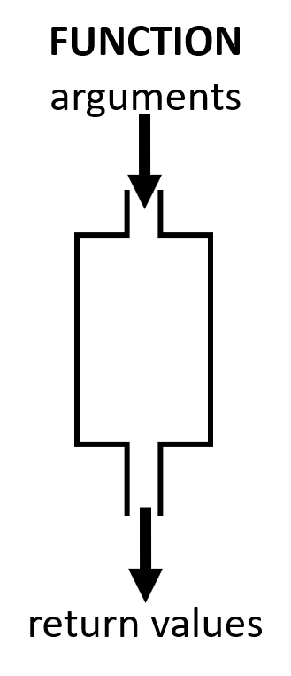
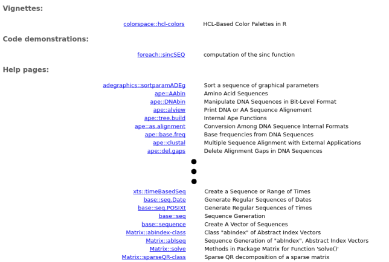
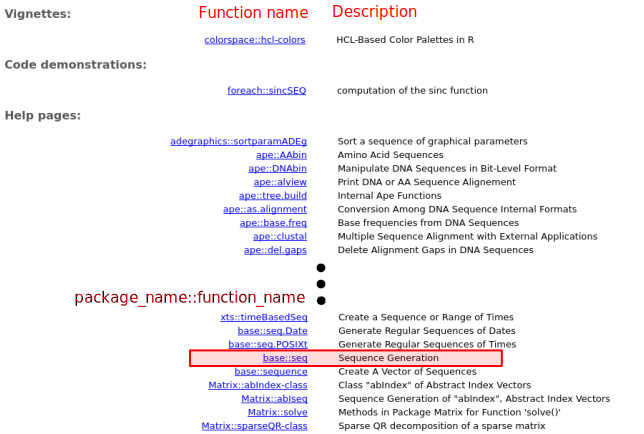

```{r setup, include = FALSE}
knitr::opts_chunk$set(
  comment = "#",
  collapse = TRUE,
  warning = FALSE,
  message = FALSE,
  fig.width=5, fig.height=5, fig.retina=3,
  fig.align = 'center'
)
options(repos=structure(c(CRAN="http://cran.r-project.org")))
```

class: inverse, center, middle

# About this workshop

```{R echo = FALSE, results = "asis"}
qcbsRworkshops::get_badges(workshop_id = 1, style = "for-the-badge", clip = FALSE)
```

---
# Learning Objectives
<br>

##### 1. Understand what R and RStudio are;

##### 2. Use R as a calculator;

##### 3. Manipulate objects in R;

##### 4. Install, use an R package and get help.


---
class: inverse, center, middle

# 1. Understand what R and RStudio are

<hr>

## Introduction

---

# What is R?

.pull-left[
* R is an open source programming language and environment. 
* It is designed for data analysis, graphical display and data simulations. 
* It is one of the world's leading statistical programming environment.

]

.pull-right[

]

---
# Why use R?

* **It is open source**
  - Improved **by** the public, **for** the public!
* It is free!
* It is compatible
  - R works on most existing operating systems.

<!-- .right[  ] -->

.center[

]


---
# Why use R?

.pull-left[

- An example of a workflow to analyze data without R.

<br>

```{r, echo = FALSE}
library(DiagrammeR)
  grViz("
      digraph {

      node [shape = oval, fillcolor = PaleTurquoise]
      'Data \n (Excel, SQL)'; Graphs; Tables; Statistics

      node [shape = box]
      Sigmaplot; Excel; SAS

      ##add arrows
      edge [arrowhead = none]
      'Data \n (Excel, SQL)' -> Sigmaplot; 'Data \n (Excel, SQL)' -> Excel; 'Data \n (Excel, SQL)' -> SAS;

      edge [arrowhead = normal]
      Sigmaplot -> Graphs; Excel -> Tables; SAS -> Statistics;

      }")

```
]

---
# Why use R?

.pull-left[

- An example of a workflow to analyze data without R.

<br>

```{r, echo = FALSE}
library(DiagrammeR)
  grViz("
      digraph {

      node [shape = oval, fillcolor = PaleTurquoise]
      'Data \n (Excel, SQL)'; Graphs; Tables; Statistics

      node [shape = box]
      Sigmaplot; Excel; SAS

      ##add arrows
      edge [arrowhead = none]
      'Data \n (Excel, SQL)' -> Sigmaplot; 'Data \n (Excel, SQL)' -> Excel; 'Data \n (Excel, SQL)' -> SAS;

      edge [arrowhead = normal]
      Sigmaplot -> Graphs; Excel -> Tables; SAS -> Statistics;

      }")

```
]


.pull-right[

- R allows you to do almost everything and can interface with multiple other programs.

```{r, echo = FALSE}
grViz("
      digraph {

      node [shape = oval, fillcolor = PaleTurquoise]
      'Data \n (Excel, SQL)'; Graphs; Tables; Statistics

      node [shape = box]
      R

      ##add arrows
      edge [arrowhead = none]
      'Data \n (Excel, SQL)' -> R;

      edge [arrowhead = normal]
      R -> Graphs; R -> Tables; R -> Statistics;

      }")

```

]

---
# Why use R?

- More and more scientists use it every year!
- As of October 2020, only from the Comprehensive R Archive Network (CRAN), there are more than 16000 packages!

```{r, echo = FALSE,   fig.width=10, fig.height=6}
# Data from https://gist.github.com/daroczig/3cf06d6db4be2bbe3368#file-results-csv

# Load the data 
pkgs  = read.csv(file = "../data/results.csv")

# Load ggplot 
library(ggplot2)

# Graph 
ggplot(pkgs, aes(as.Date(first_release), index)) +
    geom_line(size = 2) +
    scale_x_date(date_breaks = '1 year', date_labels = '%Y') +
    scale_y_continuous(breaks = seq(0, 16000, 1000)) +
    xlab('') + ylab('') + theme_bw() +
    ggtitle('Number of R packages published on CRAN') + 
  theme(axis.ticks = element_line(colour = "black"), 
    panel.grid.minor = element_line(linetype = "blank"), 
    plot.title = element_text(size = 25, face = "bold"),
    axis.text = element_text(size = 18, colour = "black", vjust = 0), 
    axis.text.x = element_text(size = 18, colour = "black", vjust = 0.5, angle = 90), 
    axis.text.y = element_text(size = 18, vjust = 0.5, colour = "black"), 
    panel.background = element_rect(fill = NA)) +
  labs(x = NULL, y = NULL)
```


<!-- .center[] -->

---
# Cool graphs in R 

All of these graphs were made in R!

.center[]


---
# Challenge

.pull-left2[
- Throughout these workshops, challenges will be indicated by a rubik's cubes in the corner of the screen. 
- During challenges, collaborate with your neighbours!
- Don't hesitate to ask questions. 
]


.pull-right2[

]


---
# Challenge 1  

Open RStudio

<br>

.center[

]

---
## Note for Windows users

If the restriction `unable to write on disk` appears when you try to open R-Studio or to install a package. 

.center[.alert[Don't worry!]]

.large[We have the solution!]

- Close the application.
- Right-click on your R-Studio icon and chose: "Execute as administrator" to open the program.


---
# The RStudio console

- The first thing the console shows is the R version you are using. 
- When you open RStudio, there are 3 panes.
- Each panes have a series of tabs. For the moment focus on the `Console`. 
  * This is where code will be typed and run. 
  * If you opened the [workshop R script](https://github.com/QCBSRworkshops/workshop01/blob/dev/workshop01-en/ReferenceScriptWorkshop1.R), the script pane will appear. 

.center[

]


---
# How to read the console

Text in the console typically looks like this:

.comment[You always have to push "enter" for the input to run in the console.]

```{r, include = FALSE}
output <- "This is the output"
```

```{r}
output
```

What does this bracket `[ ]` in the output means?

--

The bracket helps you to locate *where* you are in the output.

```{r, echo = FALSE}
c(1:40)
```

---
# Error and Warning

- .alert[Warning message] 
  * Cautions users without halting the execution of a function. 
  * Although the function can and will give you an answer, there might be a problem with your inputs. 
  * Thus, the computation could be flawed.

- .alert[Error message] 
  * Will stop the current execution because R can’t carry it out. 
  * It indicates a problem in your code

.center[
**To solve *error*, Google is your best friend!**
]


---
class: inverse, center, middle

# 2. Using R as a calculator &nbsp; 

<hr>

## Basic operations

---
# Arithmetic Operators

- Additions and Subtractions

```{r}
1 + 1

10 - 1
```

--

- Multiplications and Divisions

```{r}
2 * 2

8 / 2
```

--

- Exponents

```{r}
2^3
```

---

# Challenge 2 


Use R to calculate the following skill testing question:

$$
2+16*24-56
$$

<br>
<br>

.comment[**Hint**: The `*` symbol is used to multiply]

---
# Challenge 2: Solution 

Use R to calculate the following skill testing question:

$$
2+16*24-56
$$

It would look like this in `R`:

```{r}
2 + 16 * 24 - 56
```

---
# Challenge 3 

Use R to calculate the following skill testing question:

$$
2+16*24-56 / (2+1)-457
$$

<br>
<br>

.comment[**Hint**: Think about the order of the operation.]

---
# Challenge 3: Solution 

Use R to calculate the following skill testing question:

$$
2+16*24-56 / (2+1)-457
$$

It would look like this in `R`:

```{r}
2 + 16 * 24 - 56 / (2 + 1) - 457
```

<br>

.comment[Note that R respects the order of the operations]

---
# R command line tip


Use the $\uparrow$ and $\downarrow$ arrow keys to reproduce previous commands.

Give it a try!


.center[

]


---
# Challenge 4 

What is the area of this circle which has a radius of $5\ cm$?

.comment[**Hint**: $$Area_{circle} = \pi \times r^2$$]

```{r echo = F}
radius <- 1
theta <- seq(0, 2 * pi, length = 200)

# Plot canvas
plot(c(-1, 1), c(-1, 1), 
     type = "n", ann = F, axes = F, asp = 1)

# Add circle
lines(x = radius * cos(theta), 
      y = radius * sin(theta), lwd =4)
arrows(0, 0, x1 = 1, length = 0, lwd = 4, col = "red")

# Center of the circle 
points(0,0, pch = 20)

# Add text to indicate the radius 
text(x = 0.05, y = .2, "radius = 5 cm", cex = 2)
```

---
# Challenge 4: Solution 


What is the area of this circle which has a radius of $5\ cm$?


```{r}
3.1416 * 5^2
```

.comment[**Hint**: Note that `R` has some built-in constant (type `Constants` in the help to see which one is present) such as &pi; so you can write:]

```{r}
pi * 5^2
```

---
class: inverse, center, middle

# 3. Manipulate objects in R

<hr>

## Object

---
# Object

- One of the most useful concepts in `R`!
- You can store values as named objects using the assignment operator `<-`

```{r, eval = FALSE}
object_name <- assigned value
```

- Basically the `<-`, represents an arrow pointing where to store the information. 
- The value on the **right** (`assigned value`) is assigned to the name on the **left** (`object_name`) with the assignment operator `<-`.
- Careful! There is no space between the less than (`<`) and minus (`-`) signs. 


--

.comment[It is also possible to use the `=` sign, but be aware that the assignment operator `<-` is generally the standardized way to store information in an object.]

---
# Object name

- Objects names can only include:

|  Type      |  Symbol |
|------------|:-------:|
| Letters    | a-z A-Z |
| Numbers    |     0-9 |
| Period     |       . |
| Underscore |       _ |

- Objects names should **always** begin with a letter.
- `R` is **case sensitive**, the names `Data1` and `data1` are not the same.
- You can **not** use special characters! (`@`, `/`, `#`, etc.)

---
# Good practices in R code

**Name**
- Try having short and explicit names for your variables. Naming a variable `var`  is not very informative.
- Use an underscore (`_`), or a dot (`.`) to separate words within a name and try to be consistent!
- Avoid using names of existing functions and variables (e.g., `c`, `table`, `T`, etc.)

--

**Space**
- Add spaces around all operators (`=`, `+`, `-`, `<-`, etc.) to make the code more readable.
- Always put a space after a comma, and never before (like in regular English).

<br>

.pull-left[
**Preferred**
```{r}
mean_x <- (2 + 6) / 2

mean_x
```
]

.pull-right[
**Not preferred**
```{r}
meanx<-(2+6)/2
mean_x
```
]


---
# Challenge 5 

Create an object with a value of `1 + 1.718282` ([_e_ or Euler's number](https://en.wikipedia.org/wiki/E_(mathematical_constant)) and name it `euler_value`.

---
# Challenge 5: Solution 


Create an object with a value of `1 + 1.718282` ([_e_ or Euler's number](https://en.wikipedia.org/wiki/E_(mathematical_constant)) and name it `euler_value`.


```{r}
euler_value <- 1 + 1.718282

euler_value
```

---
# Challenge 6 

Create a second object (you decide the name) with a name that starts with a number. What happens?

---
# Challenge 6: Solution 


Create a second object (you decide the name) with a name that starts with a number. What happens?

<br>

Creating an object name that starts with a number returns the following error:

```{r, eval = FALSE}
Error: unexpected symbol in "your object name"
```

---
# R command line tip

- Use the tab key to autocomplete scripts
- This helps avoid spelling errors and speeds up command entering

<br>

Let us try it!

--

<br>

- Enter `eu`
- Push the "tab" key on your keyboard 
- Use the arrow keys ( $\uparrow$ ) and push "enter" or "return"
- If multiple elements show up, select the correct autocomplete.

---
class: inverse, center, middle

# 3. Manipulate objects in R

<hr>

## Types of data structures in R

---
# Types of data structures in R

<!--  -->


---
# Types of data structures in R

`vector` 
- A combination of elements of the same data type. 
- Basic data structure of R; all other objects consist of one or more vectors.

--

`matrix`
- 2D object generated by combining multiple vectors of the same type. 
- We can do operations on matrices in R (`+`, `-`, `*`, ...).

--

`array`
- 3D object generated by combining multiple matrices of the same type. 
- Vector = 1D array. Matrix = 2D array.

--

`data.frame`
- 2D object generated by combining several vectors of any type. 
- Each column must be of the same type, but two columns can differ in type. 
- Several statistical functions (e.g., regression) use data frames.

--

`list` 
- A list store collections of objects of any types.

---
# Vector

- An entity consisting of a sequence of elements of the same basic type
- A single value is called an *atomic value* (because it can't be divided)
- All values of a vector must have the **same mode** (or class).
      * Numeric: only numbers (e.g., `c(1,0.3,42)`)
      * Logical: True/False entries (e.g., `c(TRUE, TRUE, FALSE)`)
      * Character: Text, or a mix of text and other modes (e.g., `c("QCBS","GRIL","CEF")`)

---
# Vector

- Creating vectors usually requires the `c()` function

.comment[`c` stands for *combine* or *concatenate*.]

- The syntax is:

```{r, eval = FALSE}
vector <- c(value1, value2, ...)
```

Now we will look at different types of vectors in `R`.

---
# Vector

- Numeric vector

```{r}
num_vector <- c(1, 4, 3, 98, 32, -76, -4)

num_vector
```

--

- Character vector

```{r}
char_vector <- c("blue", "red", "green")

char_vector
```

--

- Logical vector

```{r}
bool_vector <- c(TRUE, TRUE, FALSE) # or c(T, T, F)

bool_vector
```

---
# Challenge 7 

- Create a vector containing the first 5 odd numbers, starting from 1
- Name it `odd_n`

---
# Challenge 7: Solution 


- Create a vector containing the first 5 odd numbers, starting from 1
- Name it `odd_n`


```{r}
odd_n <- c(1, 3, 5, 7, 9)
```

Or 

```{r}
odd_n <- seq(from = 1, to = 9, by = 2)

odd_n
```

---
# Vector


.comment[**Note**: Use the `dput` function to obtain the structure of an object.]
````{r}
dput(odd_n)
````

.comment[These functions are really useful to provide a reproducible example for a question on [**stackoverflow**](https://stackoverflow.com) for instance (see one more application in the part about data frames) !]
---
# Vector

We can use vectors for calculations

```{r}
x <- c(1:5)
y <- 6
```

.comment[The colon symbol `:` is used to combine all values between the first and the second provided numbers. `c(1:5)` is equivalent to  `c(1, 2, 3, 4, 5)`]

--

Let us find see what happens when we add and multiply the two objects together:

```{r}
x + y

x * y
```

---
# Data frame

- Used to store data tables
- A list of vectors of the same length
- Columns = variables
- Rows = observations, sites, cases, replicates, ...
- Different columns can have different modes

---
# Data frame

Let us say you want to store this table in `R`:

<br>

|site_id|soil_pH|num_sp|treatment|
|---|---|---|---|
|A1.01|5.6|17|Fertilised|
|A1.02|7.3|23|Fertilised|
|B1.01|4.1|15|Not Fertilised|
|B1.02|6.0|7|Not Fertilised|

where 
- "site_id" is the ID of the site 
- "soil_pH" is the soil pH 
- "num_sp" is the number of species 
- the last column is the treatment applied 

---
# Data frame

One way of doing it is:
- Start by creating vectors

```{r}
site_id <- c("A1.01", "A1.02", "B1.01", "B1.02")
soil_pH <- c(5.6, 7.3, 4.1, 6.0)
num_sp <- c(17, 23, 15, 7)
treatment <- c("Fert", "Fert", "No_fert", "No_fert")
```

--

- We then combine them using the function `data.frame`

```{r}
my_df <- data.frame(site_id, soil_pH, num_sp, treatment)
my_df
```

.comment[We will come back to the `data.frame` function later.]

---
# Data frame
.comment[Hint: Here the `dput` function in another example.]
````{r comment=NA, eval = FALSE}
dput(my_df)
````

Will return: 

```{r eval = FALSE}
structure(list(site_id = c("A1.01", "A1.02", "B1.01", "B1.02"
), soil_pH = c(5.6, 7.3, 4.1, 6), num_sp = c(17, 23, 15, 7), 
treatment = c("Fert", "Fert", "No_fert", "No_fert")), 
class = "data.frame", row.names = c(NA, -4L))
```


---
# Data frame
.comment[It is possible to rebuild the initial data frame (with some associated metadata as the class of variables) by copying and pasting the previous output shown here:]

````{r}
structure(list(site_id = c("A1.01", "A1.02", "B1.01", "B1.02"
), soil_pH = c(5.6, 7.3, 4.1, 6), num_sp = c(17, 23, 15, 7), 
treatment = c("Fert", "Fert", "No_fert", "No_fert")), 
class = "data.frame", row.names = c(NA, -4L))
````
---
# Indexing objects

- To look at or extract part of our data, you can use **brackets** `[]`

- We indicate the **position** of the values we want to see between the brackets. It is called *indexing*.

- Note that the way we index will depend on the dimensions of the object. 
  * For vectors, there is only one dimension: `["location"]`
  * For data frames, the first position is "rows", and the second is "columns", separated by a comma:  `["rows","columns"]`
  * To indicate the position of multiple elements, we place the values in a vector using `c()`: `[c("rows1":"rows10"),c("columns5","columns7")]`

Let us see how to index a vector object in R. 

---
# Indexing vectors


You can use indexing to choose a particular position, let us say we want to see the second value of our `odd_n` vector.

.comment[Recall that 
```{r}
odd_n <- seq(1,9, by = 2)
```
]

--

Let us index the second position:
```{r}
odd_n[2]
```

--

Multiple positions within a vector can be attained with `c()`:

```{r}
odd_n[c(2, 4)]
```

--

We can remove some values at particular positions using the minus (`-`) sign: 

```{r}
odd_n[-c(1, 2)]
```

---
# Indexing vectors


If you select a position that is not in the vector, it will return:

```{r}
odd_n[c(1, 6)]
```

--

You can also use conditions to select values:

```{r}
odd_n[odd_n > 4]
```

--

It is also possible to match a character string. 

.comment[Recall that
```{r}
char_vector <- c("blue", "red", "green")
```

]

```{r}
char_vector[char_vector == "blue"]
```

.comment[Logical statements such as `>` will be described in more details later.]


---
# Challenge 8 

Using the vector `num_vector` and our indexing abilities


- Extract the 4th value
- Extract the 1st and 3rd values
- Extract all values except for the 2nd and the 4th

.comment[ Recall that
```{r}
num_vector <- c(1, 4, 3, 98, 32, -76, -4)
```
]

---
# Challenge 8: Solution 

Using the vector `num_vector` and our indexing abilities


- Extract the 4th value

```{r}
num_vector[4]
```

- Extract the 1st and 3rd values

```{r}
num_vector[c(1, 3)]
```

- Extract all values except for the 2nd and the 4th

```{r}
num_vector[c(-2, -4)]
```

---
# Challenge 9 

Explore the difference between these 2 lines of code:

```{r, eval = FALSE}
char_vector == "blue"

char_vector[char_vector == "blue"]
```

---
# Challenge 9: Solution 

Explore the difference between these 2 lines of code:

```{r}
char_vector == "blue"
```

In this line of code, you **test a logical statement**. For each entry in the `char_vector`,  `R` checks whether the entry is equal to `blue` or not.

```{r}
char_vector[char_vector == "blue"]
```

In this line of code, you ask `R` to extract all values within the `char_vector` vector that are exactly equal to `blue`.

---
# Indexing data frames

To index a `data frame` you must specify two dimensions: row and column numbers, using the following syntax:

```r
data_frame_name[row, column]
```

---
# Indexing data frames: examples

`my_df[1, ]`
- Extracts the first row

.comment[Note that an empty index select **all** the values.]

`my_df[, 3]` 
- Extracts the third column

`my_df[2, 4]` 
- Extracts the second element of the fourth column


---
# Indexing data frames: examples
`my_df[c(2, 4), ]`  
- Extracts rows 2 and 4

.comment[The examples given so far are also valid for indexing matrices, this is not the case for the following examples.]

<br>

The `$` calls a specific column name in the data frame

`my_df$site_id`  
- Extracts the variable `site_id` from the data frame

`my_df$site_id[2]` 
- Extracts the second value of the variable `siteID` from the data frame


`my_df[c("site_id", "soil_pH")]`  
- Extracts the `site_id` and `soil_pH` variables from the data frame.


---
# A quick note on logical statements

`R` allows testing of logical statements, *i.e.* testing whether a statement is true or false.

You need to use logical operators for that.

<br>

|Operator|Description|Example|
|-------------|-------------------------|-------------------------------|
|`<` and `>`  |less than or greater than|`odd_n > 3`                    |
|`<=` and `>=`|less/greater or equal to |`odd_n >= 3`                   |
|`==`         |exactly equal to         |`odd_n == 3`                   |
|`!=`         |not equal to             |`odd_n != 3`                   |
|`x`&#124;`y` |x OR y                   |`odd_n[odd_n >= 5` &#124; `odd_n < 3]`|
|`x & y`      |x AND y                  |`odd_n[odd_n >=3 & odd_n < 7]` |
|`x %in% y `  |x match y                |`odd_n[odd_n %in% c(3,7)]` |

---
# Challenge 10 

1. Extract the `num_sp` column from `my_df` and multiply its value by the first four values of `num_vec`.

2. After that, write a statement that checks if the values you obtained are greater than 25.

---
# Challenge 10: Solution 

1. Extract the `num_sp` column from `my_df` and multiply its value by  the first four values of `num_vec`.

```{r}
my_df$num_sp * num_vector[c(1:4)]
# or
my_df[, 3] * num_vector[c(1:4)]
```

2. After that, write a statement that checks if the values you obtained are greater than 25.


```{r}
(my_df$num_sp * num_vector[c(1:4)]) > 25
```

---
# Matrix, Array and List

- In this course, we focus mainly on `vectors` and `data frames`.
- But in the future, you might need to use a matrix, an array or a list.
- Note that the way to access the information in the type of data structure will differ depending on the dimension of the object.

.center[

]

---
class: inverse, center, middle

# 3. Manipulate objects in R

<hr>

## Function

---
# Function

.pull-left2[
- A function is a tool to simplify your life.

- It allows you to quickly execute operations on objects without having to write every mathematical step.

- A function needs entry values called **arguments** (or parameters). It then performs hidden operations using these arguments and gives a **return value**.
]

.pull.right2[

]

---
# Function

To use (or to call) a function, the command must be structured properly, following the "grammar rules" of the `R` language: the syntax.

```{r, eval = FALSE}
function_name(argument1, argument2, etc.)
```

---
# Arguments

Arguments are **values** and **instructions** the function needs to run.

Objects storing these values and instructions can be used in functions:

```{r}
a <- 3
b <- 5
sum(a, b)
```

---
# Challenge 11 

- Create a vector `a` that contains all the numbers from 1 to 5
- Create an object `b` that has a value of 2
- Add `a` and `b` together using the basic `+` operator and save the result in an object called `result_add`
- Add `a` and `b` together using the `sum` function and save the result in an object called `result_sum`
- Are `result_add` and `result_sum` different? 
- Add `5` to `result_sum` using the `sum` function

---
# Challenge 11: Solution  

```{r}
a <- c(1:5)
b <- 2

result_add <- a + b

result_sum <- sum(a, b)
```

```{r}
result_add

result_sum

sum(result_sum, 5)
```

--

The operation `+` on the vector `a` adds 2 to each element. The result is a vector.

The function `sum` concatenates all the values provided and then sum them. It is the same as doing `1+2+3+4+5+2`.

---
# Arguments

- Arguments each have a **name** that can be provided during a function call.

- If the name is not present, the order of the arguments does matter.

- If the name is present, the order does not matter.

---
# Challenge 12 

`plot` is a function that draws a graph of y as a function of x. It requires two arguments names `x` and `y`. What are the differences between the following lines?

```{r, eval = FALSE}
a <- 1:100
b <- a^2
plot(a, b, type = "l")
plot(b, a, type = "l")
plot(x = a, y = b, type = "l")
plot(y = b, x = a, type = "l")
```

.comment[The argument `type` of the function `plot` let you choose the type of graph you want. Try it without this argument.]

---
# Challenge 12: Solution 

`plot` is a function that draws a graph of y as a function of x. It requires two arguments names `x` and `y`. What are the differences between the following lines?

```{r, echo = F, fig.height=7,fig.width=9}
a <- 1:100
b <- a^2
par(mfrow = c(2, 2), mar = c(4, 4, 1, 1))
plot(a, b, type = "l")
plot(b, a, type = "l")
plot(x = a, y = b, type = "l")
plot(y = b, x = a, type = "l")
```

---
# Challenge 12: Solution

.pull-left[
```{r,eval=F}
plot(a, b, type = "l")
```

```{r, echo = FALSE, fig.width = 3.6, fig.height = 3.6}
par(mar = c(4, 4, 1, 1))
plot(a, b, type = "l")
```
]

.pull-right[
```{r,eval = FALSE}
plot(b, a, type = "l")
```

```{r, echo = FALSE, fig.width = 3.6, fig.height = 3.6}
par(mar = c(4, 4, 1, 1))
plot(b, a, type = "l")
```
]

The shape of the plot changes, as we did not provide the argument's names, the order is important.

---
# Challenge 12: Solution

.pull-left[
```{r,eval = FALSE}
plot(x = a, y = b, type = "l")
```

```{r, echo = FALSE, fig.width = 3.6, fig.height = 3.6}
par(mar = c(4, 4, 1, 1))
plot(x = a, y = b, type = "l")
```
]

.pull-right[
```{r,eval = FALSE}
plot(y = b, x = a, type = "l")
```

```{r, echo = FALSE, fig.width = 3.6, fig.height = 3.6}
par(mar = c(4, 4, 1, 1))
plot(y = b, x = a, type = "l")
```
]

Same as `plot(a, b, type = "l")`. The argument names are provided, the order is not important.

---
class: inverse, center, middle

# 4. Install, use an R package and get help

## Package

---
# Package

Packages are a **grouping of functions** and/or **datasets** that share a similar **theme**, e.g. statistics, spatial analysis, plotting, etc.

**Everyone** can develop packages and make them available to others.

Many packages available through the *Comprehensive R Archive Network* [CRAN](http://cran.r-project.org/web/packages/) and now many more on GitHub [GitHub](https://github.com/).

<br>

.alert[Guess how many packages are available (not only on the CRAN)?]

---
# How many packages


*[rdrr.io](https://rdrr.io/) visited on March, 10th 2020*

---
# Package

To install packages on your computer, use the function `install.packages`.

```r
install.packages("package name")
```

Installing a package is not enough to use it. You need to load it into your workspace before using it using the `library` function.

```r
library(package name)
```

---
# Package: an example

Let us install a popular visualization package called ggplot (grammar of graphics plot)

```{r, eval = FALSE}
install.packages("ggplot2")
```

```{r, eval = FALSE, echo = FALSE}
Installing package into '/home/labo/R/x86_64-redhat-linux-gnu-library/3.3'
(as 'lib' is unspecified)
```

```{r, eval = FALSE, echo = FALSE}
library(ggplot2)
```

Now we will use the function `qplot` from the package
```{r, eval = FALSE}
qplot(1:10, 1:10)
```

--

Did you get this error?
```{r, eval = FALSE}
## Error: could not find function "qplot"
```

---
# Package: an example

We need to gain access the functions that are available in the installed package. To do this, load `ggplot2` using the `library()` function.

```{r}
library(ggplot2)
```

Now we can draw the graph 
```{r, fig.width = 4, fig.height = 4}
qplot(1:10, 1:10)
```

  .comment[The `ggplot2` package, will be covered in workshop #3 - [**Introduction to ggplot2**](https://wiki.qcbs.ca/r_workshop3).]
---
class: inverse, center, middle

# 4. Install, use an R package and get help

<hr>

## Getting help

---
# Searching for functions

WOW! `R` is so great! So many functions to do what I want!

But... how do I find them?

--

To find a function that does something specific in your installed packages, you can use `??` followed by a search term.

Let us say we want to create a *sequence* of odd numbers between 0 and 10 as we did earlier. We can search in our packages all the functions with the word "sequence" in them:

```{r, eval = FALSE}
??sequence
```

---
# Search results



---
# Search results


---
# Search results



---
# Getting help with functions

OK! So let us use the `seq` function!

But wait... how does it work? What arguments does it need?

To find information about a function in particular, use `?`

```{r, eval = FALSE}
  ?seq
```

---
# Help pages


---
# Description

- `function_name {package_name}`
- `Description`: a short description of what the function does.


---
# Usage

- How to call the function
- If `name = value` is present, a default value is provided if the argument is missing. The argument becomes optional.
- Other related functions described in this help page


---
# Arguments

- Description of all the arguments and what they are used for


---
# Details

- A detailed description of how the functions work and their characteristics


---
# Value, See Also, and Examples

- A description of the return value


--

- Other related functions that can be useful


--

- Reproducible examples


---
# Challenge 13 

1. Create a sequence of even numbers from 0 to 10 using the `seq` function.

2. Create an unsorted vector of your favourite numbers, then sort your vector in reverse order.

---
# Challenge 13: Solutions 

1. Create a sequence of even numbers from 0 to 10 using the `seq` function.

.pull-left[
```{r class = "fragment"}
seq(from = 0, to = 10, by = 2)
```
]

.pull-right[
```{r class = "fragment"}
seq(0, 10, 2)
```
]


2. Create an unsorted vector of your favorite numbers, then sort your vector in reverse order.

```{r class = "fragment"}
numbers <- c(2, 4, 22, 6, 26)
sort(numbers, decreasing = TRUE)
```

---
# Other ways to get help

Usually, your best source of information will be your favorite search engine!

Here are some tips on how to use them efficiently:
- Search in English
- Use the keyword "R" at the beginning of your search
- Define precisely what you are looking for
- Learn to read discussion forums, such as [StackOverflow](https://stackoverflow.com/). Chances are other people already had your problem and asked about it.
- Don't hesitate to search again using different keywords!

---
# Challenge 14 

Find the appropriate functions to perform the following operations:

- Square root
- Calculate the mean of numbers
- Combine two data frames by columns
- List available objects in your workspace

---
# Challenge 14: Solutions 

Find the appropriate functions to perform the following operations:

- Square root
  - `sqrt`
- Calculate the mean of numbers
  - `mean`
- Combine two data frames by columns
  - `cbind`
- List available objects in your workspace
  - `ls`

---
class: inverse, center, middle

# Additional resources

---
# Cheat 4ever

.center[

]


Lots of [cheat sheets](https://www.rstudio.com/resources/cheatsheets/) are available online.

Open it directly from **RStudio**: Help $\rightarrow$ Cheatsheets


---
# Cheat 4ever


---
# Some useful R books

.center[
  
]
.center[
  
]

---
# Some useful R websites

.pull-left[
[](http://r4ds.had.co.nz/index.html)

[**An Introduction to R**](https://cran.r-project.org/doc/manuals/r-release/R-intro.html)

[**R Reference card 2.0**](http://cran.r-project.org/doc/contrib/Baggott-refcard-v2.pdf)

]

.pull-right[
[](http://statmethods.net/)

[](https://support.rstudio.com/hc/en-us/categories/200035113-Documentation)

[**Cookbook for R**](http://cookbook-r.com/)
]


---
class: inverse, center, bottom

# Thank you for attending!

<hr>


<br><br><br><br>
